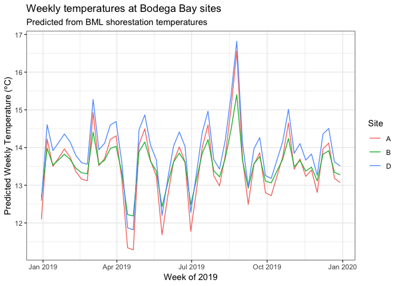
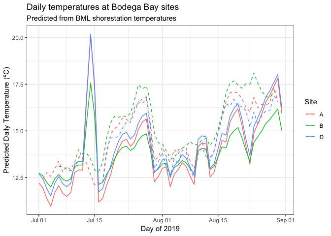

BodegaPredictedTemps
================
LRA
5/26/2020

## Predicting Bodega Bay temps in 2019

We can’t use satellite SST measurements for the Bodega sites - the
closes satellite pixels are offshore. No loggers were deployed during
the time period of interest (Jan-June 2019). However, Bodega Marine Lab
has a temperature station that records hourly water temperatures. Jay’s
group has older logger data (from 2012-2014) that we can use to regress
site-specific temperatures against the BML shorestation. Then, we can
predict 2019 site-specific temperatures based on the 2019 BML
temperatures.

In principle, I think this approach is okay. But it turns out the Bodega
Bay seasonal patterns are quite different from the other sites, so we
may not be able to calculate a rate of spring warming for these sites.

<!-- -->

This plot shows the weekly temperatures at the three Bodega Bay meadows,
predicted based on the BML shorestation data. These predicted temps show
almost no spring warming at all. Weekly temperatures in Spring
(April-June) are actually colder than weekly temperatures in Winter
(Jan-March). Note, the predictive relationshps were made at the daily
level, but here I’m plotting the weekly temperatures to better see
seasonal patterns.

There is some warming in summmer - July and August. But overall
temperatures are stable most of the year.

We can verify the predicted temperatures in July and August by plotting
the predicitons with the in situ logger data (NSF project loggers were
deployed in early July).

<!-- -->

Here, the predicted temperatures are solid lines and the in situ logger
temperatures are dashed lines. This plot shows that during July and
August, the predicted temperatures track fairly well with the in situ
temperatures. There’s a spike in mid-July at the shorestation that
doesn’t show up in the in situ. And, B is consistently the warmest
site from the in situ measurements but only sometimes the warmest from
the predictions. However, the overall pattern of the predictions matches
the in situ measurments well during the late summer period.

### Implications

1)  At a large scale, Bodega Bay has different seasonal patterns
    compared to the other regions, i.e. spring can be colder than
    winter, and there is not necessarily a strong warming signal during
    spring.

2)  The lack of spring warming in Bodega partially undermines the
    hypothesis that spring warming is an important driver of disease. BB
    sites A, B, and D have prevalence of 75, 78 and 92% respectively,
    yet show no spring warming trend. Perhaps other environmental
    drivers overwhelm the effect of temperature in this region. Or, the
    temperature signal is an artifact of other differences between
    sites.
