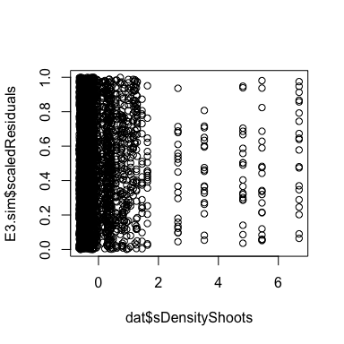
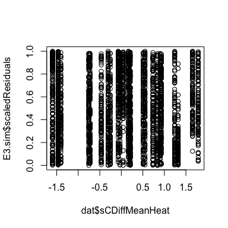
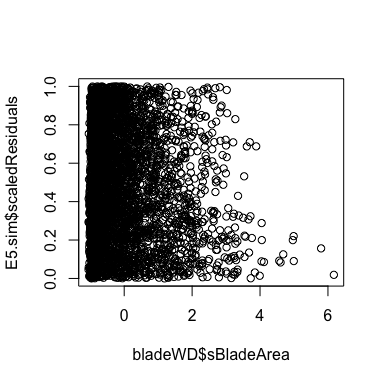

Blade\_models\_hurdle\_glmm
================
LRA
1/26/2021

## Blade level models of prevalence and severity

Blade level models are fit as hurdles - binomial/logistic regression for
prevalence, beta regression for severity of diseased blades only

Two sets of models, one with cumulative positive temperature anomaly as
a predictor, one without.

Because only 27 meadows out of 32 have SST data for the anomaly
calculation, the number of replicates is smaller for those models.

However, the significant effects are mainly the same across the models.

Predictors are: Blade Area, Shoot Density, Epiphyte Mass per Blade Area,
Cumulative positive anomaly, Tidal Height, and all interactions between
Tidal Height and fixed effects.

Random structure for blades is Transect within Meadow within Region.
However, for the CPTA models (models that include the temperature
anomaly as a predictor), Region is not sufficiently variable to be used
as a random effect (possibly due to unbalanced availability of SST
across regions). Consistently, across all models, Region is not a
significant fixed effect either and the model can be simplified to
remove Region.

Final CPTA models therefore use Transect within Meadow for the random
structure at the blade level.

Here I am not showing all the detail of model selection and validation
(some things are commented out) so that the summary outputs are from the
final models only.

### blade level prevalence with CPTA (n=3177)

    ##             df      AIC  deltaAIC  likelihood      weight
    ## fit_prev3   12 3487.055 0.3031214 0.859365722 0.244502657
    ## fit_prev3.1 11 3486.798 0.0457500 0.977384650 0.278080842
    ## fit_prev3.2 11 3490.619 3.8673200 0.144617928 0.041146006
    ## fit_prev3.3 11 3486.752 0.0000000 1.000000000 0.284515254
    ## fit_prev3.4 11 3488.312 1.5594847 0.458524143 0.130457113
    ## fit_prev3.5  8 3492.161 5.4092813 0.066894359 0.019032465
    ## fit_prev3.6  7 3496.418 9.6658405 0.007963232 0.002265661

By AIC and weight, fit\_prev3.3 (no epiphyte load: tidal height
interaction) is best.

<!-- --><!-- --><!-- --><!-- --><!-- --><!-- -->

    ##  Family: binomial  ( logit )
    ## Formula:          
    ## Prevalence ~ sBladeArea + sDensityShoots + sEpiphytePerAreaMean +  
    ##     sCDiffMeanHeat + TidalHeight + sBladeArea:TidalHeight + sDensityShoots:TidalHeight +  
    ##     sCDiffMeanHeat:TidalHeight + (1 | MeadowId) + (1 | TransectId)
    ## Data: dat
    ## 
    ##      AIC      BIC   logLik deviance df.resid 
    ##   3486.8   3553.5  -1732.4   3464.8     3166 
    ## 
    ## Random effects:
    ## 
    ## Conditional model:
    ##  Groups     Name        Variance Std.Dev.
    ##  MeadowId   (Intercept) 1.4472   1.2030  
    ##  TransectId (Intercept) 0.6908   0.8312  
    ## Number of obs: 3177, groups:  MeadowId, 27; TransectId, 162
    ## 
    ## Conditional model:
    ##                             Estimate Std. Error z value Pr(>|z|)    
    ## (Intercept)                  0.01359    0.26972   0.050   0.9598    
    ## sBladeArea                   0.50144    0.10023   5.003 5.64e-07 ***
    ## sDensityShoots               0.83511    0.41354   2.019   0.0434 *  
    ## sEpiphytePerAreaMean        -0.04920    0.09578  -0.514   0.6075    
    ## sCDiffMeanHeat               1.09147    0.26167   4.171 3.03e-05 ***
    ## TidalHeightU                 0.32945    0.19212   1.715   0.0864 .  
    ## sBladeArea:TidalHeightU      0.21233    0.16695   1.272   0.2034    
    ## sDensityShoots:TidalHeightU -0.81342    0.37572  -2.165   0.0304 *  
    ## sCDiffMeanHeat:TidalHeightU -0.26169    0.17200  -1.521   0.1281    
    ## ---
    ## Signif. codes:  0 '***' 0.001 '**' 0.01 '*' 0.05 '.' 0.1 ' ' 1

    ## # Indices of model performance
    ## 
    ## AIC     |     BIC | R2 (cond.) | R2 (marg.) |  ICC | RMSE | Sigma | Log_loss | Score_log | Score_spherical
    ## ----------------------------------------------------------------------------------------------------------
    ## 3486.75 | 3553.45 |       0.49 |       0.16 | 0.39 | 0.40 |  1.00 |     0.49 |      -Inf |        3.75e-04

    ## Scale for 'y' is already present. Adding another scale for 'y', which will
    ## replace the existing scale.

    ## Scale for 'colour' is already present. Adding another scale for 'colour',
    ## which will replace the existing scale.

<!-- -->
\#\#\# Blade level prevalence, no CPTA n = 3702 \#\#\#\#

This is the prevalence model without any temperature terms, with the
full 3702 blade dataset.

For this model, Region can be included in the random part

    ##             df      AIC   deltaAIC  likelihood       weight
    ## fit_prev5   11 4057.710  0.0000000 1.000000000 0.4733604888
    ## fit_prev5.1 10 4061.633  3.9233292 0.140624140 0.0665659115
    ## fit_prev5.2 10 4060.552  2.8418020 0.241496329 0.1143148203
    ## fit_prev5.3 10 4058.376  0.6664256 0.716617668 0.3392184896
    ## fit_prev5.4  8 4066.581  8.8710658 0.011848750 0.0056087301
    ## fit_prev5.5  7 4070.171 12.4615043 0.001967971 0.0009315598

By AIC and weight, best-fitting model is the full model (fit\_prev5).

<!-- --><!-- --><!-- --><!-- --><!-- -->

    ##  Family: binomial  ( logit )
    ## Formula:          
    ## Prevalence ~ sBladeArea + sDensityShoots + sEpiphytePerAreaMean +  
    ##     TidalHeight + sBladeArea:TidalHeight + sDensityShoots:TidalHeight +  
    ##     sEpiphytePerAreaMean:TidalHeight + (1 | Region) + (1 | MeadowId) +  
    ##     (1 | TransectId)
    ## Data: bladeWD
    ## 
    ##      AIC      BIC   logLik deviance df.resid 
    ##   4057.7   4126.1  -2017.9   4035.7     3691 
    ## 
    ## Random effects:
    ## 
    ## Conditional model:
    ##  Groups     Name        Variance Std.Dev.
    ##  Region     (Intercept) 1.2354   1.1115  
    ##  MeadowId   (Intercept) 1.2496   1.1178  
    ##  TransectId (Intercept) 0.6521   0.8075  
    ## Number of obs: 3702, groups:  Region, 6; MeadowId, 32; TransectId, 192
    ## 
    ## Conditional model:
    ##                                   Estimate Std. Error z value Pr(>|z|)    
    ## (Intercept)                        0.02348    0.51195   0.046   0.9634    
    ## sBladeArea                         0.41859    0.09322   4.490 7.11e-06 ***
    ## sDensityShoots                     0.81021    0.39244   2.065   0.0390 *  
    ## sEpiphytePerAreaMean               0.30397    0.24710   1.230   0.2186    
    ## TidalHeightU                       0.29277    0.17834   1.642   0.1007    
    ## sBladeArea:TidalHeightU            0.37527    0.15467   2.426   0.0153 *  
    ## sDensityShoots:TidalHeightU       -0.76616    0.35274  -2.172   0.0299 *  
    ## sEpiphytePerAreaMean:TidalHeightU -0.38350    0.23733  -1.616   0.1061    
    ## ---
    ## Signif. codes:  0 '***' 0.001 '**' 0.01 '*' 0.05 '.' 0.1 ' ' 1

    ## # Indices of model performance
    ## 
    ## AIC     |     BIC | R2 (cond.) | R2 (marg.) |  ICC | RMSE | Sigma | Log_loss | Score_log | Score_spherical
    ## ----------------------------------------------------------------------------------------------------------
    ## 4057.71 | 4126.09 |       0.51 |       0.04 | 0.49 | 0.40 |  1.00 |     0.49 |      -Inf |        3.19e-04

    ## Scale for 'y' is already present. Adding another scale for 'y', which will
    ## replace the existing scale.

    ## Scale for 'colour' is already present. Adding another scale for 'colour',
    ## which will replace the existing scale.

<!-- -->

## Blade level severity, with CPTA (n=1573)

Severity at the blade level is the second part of the hurdle, so it is
only modeled on the diseased blades.

Same approach to having two models, one with fewer replicates because of
the availability of SST for the anomaly calculation.

These models are fit with beta regression, as severity is a non-count
proportion.

    ##            df       AIC   deltaAIC likelihood      weight
    ## fit_sev3   13 -4754.989 1.95734298 0.37581004 0.137099225
    ## fit_sev3.1 12 -4756.869 0.07751412 0.96198439 0.350941438
    ## fit_sev3.2 12 -4748.751 8.19583413 0.01660723 0.006058483
    ## fit_sev3.3 12 -4753.666 3.28074236 0.19390805 0.070739580
    ## fit_sev3.4 12 -4756.947 0.00000000 1.00000000 0.364809910
    ## fit_sev3.5  9 -4751.029 5.91725159 0.05189018 0.018930050
    ## fit_sev3.6  8 -4753.028 3.91864738 0.14095372 0.051421313

By AIC and weight, best model is fit\_sev3.4 (no cumulative
anomlay:tidal height interaction)

<!-- --><!-- --><!-- --><!-- --><!-- --><!-- --><!-- -->

    ## 
    ##  DHARMa nonparametric dispersion test via sd of residuals fitted vs.
    ##  simulated
    ## 
    ## data:  simulationOutput
    ## ratioObsSim = 1.286, p-value < 2.2e-16
    ## alternative hypothesis: two.sided

    ##  Family: beta  ( logit )
    ## Formula:          
    ## Severity ~ sBladeArea + sDensityShoots + sEpiphytePerAreaMean +  
    ##     sCDiffMeanHeat + TidalHeight + sBladeArea:TidalHeight + sDensityShoots:TidalHeight +  
    ##     sEpiphytePerAreaMean:TidalHeight + (1 | MeadowId) + (1 |      TransectId)
    ## Data: sevdat
    ## 
    ##      AIC      BIC   logLik deviance df.resid 
    ##  -4756.9  -4692.6   2390.5  -4780.9     1561 
    ## 
    ## Random effects:
    ## 
    ## Conditional model:
    ##  Groups     Name        Variance Std.Dev.
    ##  MeadowId   (Intercept) 0.19368  0.4401  
    ##  TransectId (Intercept) 0.07434  0.2726  
    ## Number of obs: 1573, groups:  MeadowId, 27; TransectId, 155
    ## 
    ## Overdispersion parameter for beta family (): 7.55 
    ## 
    ## Conditional model:
    ##                                   Estimate Std. Error z value Pr(>|z|)    
    ## (Intercept)                       -2.30313    0.10582 -21.765  < 2e-16 ***
    ## sBladeArea                        -0.09642    0.04776  -2.019  0.04352 *  
    ## sDensityShoots                     0.43552    0.13469   3.234  0.00122 ** 
    ## sEpiphytePerAreaMean               0.20624    0.09556   2.158  0.03091 *  
    ## sCDiffMeanHeat                     0.14241    0.08552   1.665  0.09587 .  
    ## TidalHeightU                      -0.04502    0.07672  -0.587  0.55729    
    ## sBladeArea:TidalHeightU           -0.02861    0.07613  -0.376  0.70705    
    ## sDensityShoots:TidalHeightU       -0.36732    0.12267  -2.994  0.00275 ** 
    ## sEpiphytePerAreaMean:TidalHeightU -0.18172    0.09649  -1.883  0.05966 .  
    ## ---
    ## Signif. codes:  0 '***' 0.001 '**' 0.01 '*' 0.05 '.' 0.1 ' ' 1

    ## # Indices of model performance
    ## 
    ## AIC      |      BIC | R2 (cond.) | R2 (marg.) |  ICC | RMSE | Sigma
    ## -------------------------------------------------------------------
    ## -4756.95 | -4692.62 |       0.31 |       0.06 | 0.26 | 0.12 |  7.55

    ## Scale for 'y' is already present. Adding another scale for 'y', which will
    ## replace the existing scale.

    ## Scale for 'colour' is already present. Adding another scale for 'colour',
    ## which will replace the existing scale.

<!-- -->

## blade level severity, no CPTA, n=1853

Follow up model includes all diseased blades, no temperature anomaly
term.

Also fit with beta regression.

    ##            df       AIC deltaAIC likelihood     weight
    ## fit_sev2   12 -5352.669 1.976884 0.37215614 0.22927545
    ## fit_sev2.1 11 -5354.645 0.000000 1.00000000 0.61607328
    ## fit_sev2.2 11 -5347.485 7.160536 0.02786823 0.01716887
    ## fit_sev2.3 11 -5350.357 4.288248 0.11717064 0.07218570
    ## fit_sev2.4  9 -5347.779 6.866620 0.03227991 0.01988679
    ## fit_sev2.5  8 -5349.430 5.215272 0.07370860 0.04540990

By AIC and weight, best model is 2.1, no blade area:tidal height
interaction

<!-- --><!-- --><!-- --><!-- --><!-- -->

    ##  Family: beta  ( logit )
    ## Formula:          
    ## Severity ~ sBladeArea + sDensityShoots + sEpiphytePerAreaMean +  
    ##     TidalHeight + sDensityShoots:TidalHeight + sEpiphytePerAreaMean:TidalHeight +  
    ##     (1 | Region) + (1 | MeadowId) + (1 | TransectId)
    ## Data: sev
    ## 
    ##      AIC      BIC   logLik deviance df.resid 
    ##  -5354.6  -5293.9   2688.3  -5376.6     1842 
    ## 
    ## Random effects:
    ## 
    ## Conditional model:
    ##  Groups     Name        Variance Std.Dev.
    ##  Region     (Intercept) 0.02136  0.1461  
    ##  MeadowId   (Intercept) 0.20158  0.4490  
    ##  TransectId (Intercept) 0.06602  0.2569  
    ## Number of obs: 1853, groups:  Region, 6; MeadowId, 32; TransectId, 183
    ## 
    ## Overdispersion parameter for beta family (): 6.84 
    ## 
    ## Conditional model:
    ##                                   Estimate Std. Error z value Pr(>|z|)    
    ## (Intercept)                       -2.22562    0.11305 -19.688  < 2e-16 ***
    ## sBladeArea                        -0.11790    0.04408  -2.674  0.00748 ** 
    ## sDensityShoots                     0.34906    0.12197   2.862  0.00421 ** 
    ## sEpiphytePerAreaMean               0.20246    0.08197   2.470  0.01351 *  
    ## TidalHeightU                      -0.07974    0.06876  -1.160  0.24617    
    ## sDensityShoots:TidalHeightU       -0.29511    0.10837  -2.723  0.00647 ** 
    ## sEpiphytePerAreaMean:TidalHeightU -0.17143    0.08129  -2.109  0.03495 *  
    ## ---
    ## Signif. codes:  0 '***' 0.001 '**' 0.01 '*' 0.05 '.' 0.1 ' ' 1

    ## # Indices of model performance
    ## 
    ## AIC      |      BIC | R2 (cond.) | R2 (marg.) |  ICC | RMSE | Sigma
    ## -------------------------------------------------------------------
    ## -5354.65 | -5293.88 |       0.31 |       0.04 | 0.28 | 0.12 |  6.84

    ## Scale for 'y' is already present. Adding another scale for 'y', which will
    ## replace the existing scale.

    ## Scale for 'colour' is already present. Adding another scale for 'colour',
    ## which will replace the existing scale.

<!-- -->
