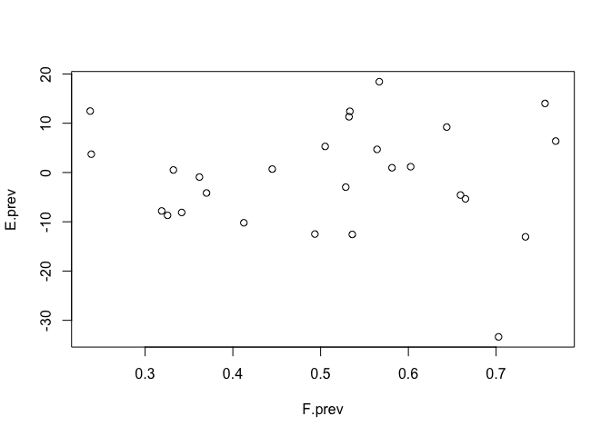
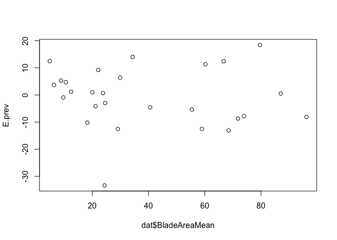
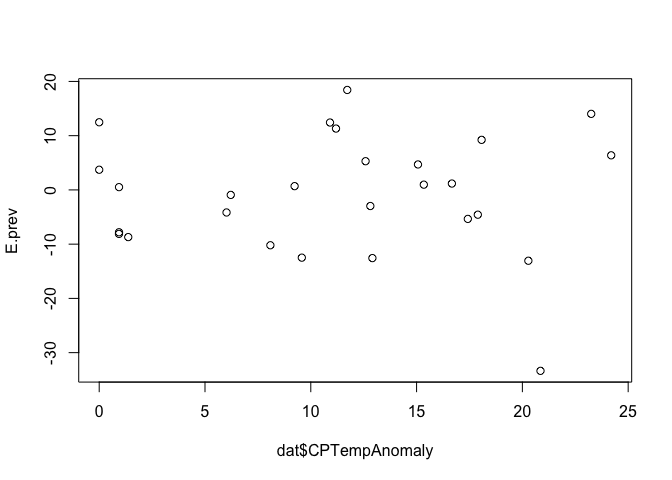
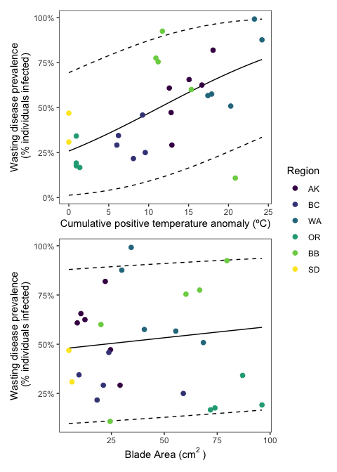
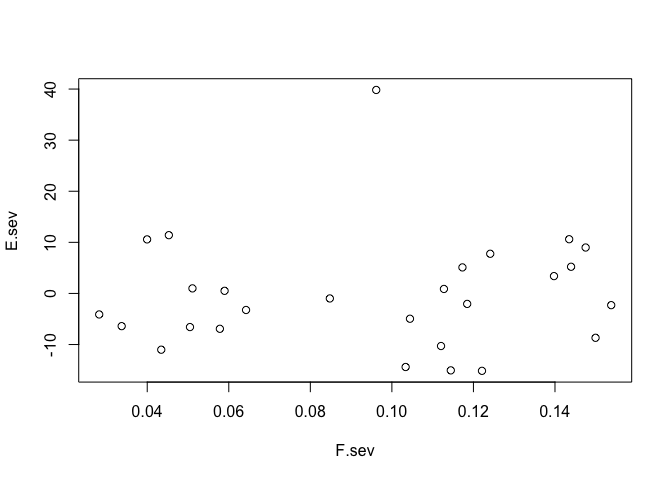
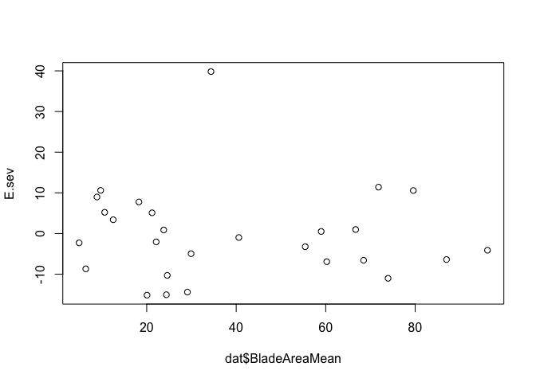
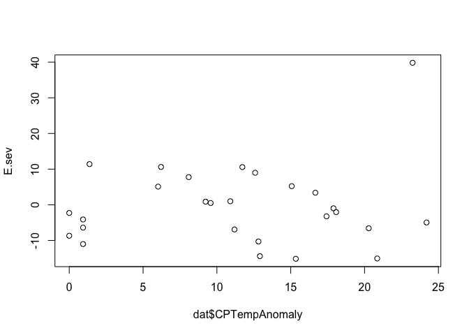
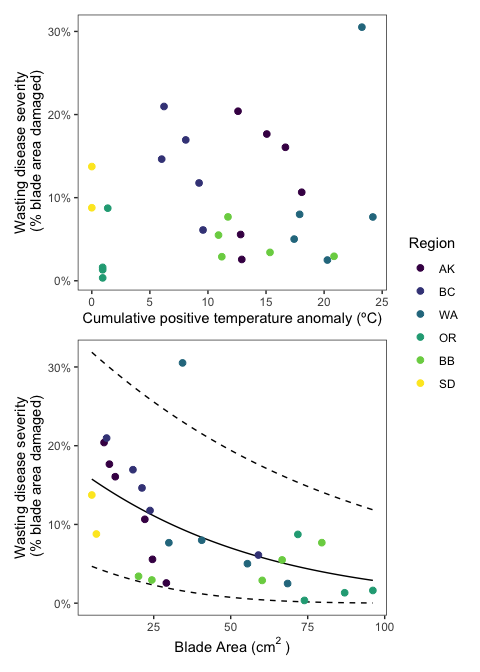

Meadow\_scale\_model
================
LRA
1/26/2021

### Meadow-scale drivers of wasting disease

Refined model of disease prevalence and severity at the meadow scale

Major predictor is cumulative temperature anomaly as a fixed effect
Other predictors to possibly include are density and blade area at the
meadow scale (as fixed effects) However, replication is n=27, so the
number of parameters that can be estimated is small (for a conservative
n/k=10, can only fit one fixed effect due to estimating intercept and
dispersion parameter. Up to 2 fixed effects keeps n/k at 6.75, still
reasonable)

### Prevalence model

Compare four models, one with cumulative anomaly and blade area as fixed
effects, one with cumulative anomaly and shoot density, third with only
cumulative anomaly and last with all three fixed effects

``` r
fit_prev1 <- betareg(PrevalenceMean~CPTempAnomaly + BladeAreaMean,
                     data=dat,
                     weights = Count,
                     link = "logit")

fit_prev2 <- betareg(PrevalenceMean~CPTempAnomaly + DensityShootsMean,
                     data=dat,
                     weights = Count,
                     link = "logit")
fit_prev3 <- betareg(PrevalenceMean~CPTempAnomaly,
                     data=dat,
                     weights = Count,
                     link = "logit")
fit_prev4 <- betareg(PrevalenceMean~CPTempAnomaly + BladeAreaMean + DensityShootsMean,
                     data=dat,
                     weights = Count,
                     link = "logit")
fit_prev5 <- betareg(PrevalenceMean~ BladeAreaMean,
                     data=dat,
                     weights = Count,
                     link = "logit")
fit_prev6 <- betareg(PrevalenceMean~ DensityShootsMean|Region,
                     data=dat,
                     weights = Count,
                     link = "logit")

AIC(fit_prev1,fit_prev2,fit_prev3,fit_prev4,fit_prev5,fit_prev6)
```

    ##           df        AIC
    ## fit_prev1  4 -1629.7837
    ## fit_prev2  4 -1593.3638
    ## fit_prev3  3 -1573.0289
    ## fit_prev4  5 -1628.3182
    ## fit_prev5  3  -260.1924
    ## fit_prev6  8 -1313.7405

First model (cumulative anomaly and blade area) is substantially better
by AIC.

    ## 
    ## Call:
    ## betareg(formula = PrevalenceMean ~ CPTempAnomaly + BladeAreaMean, data = dat, 
    ##     weights = Count, link = "logit")
    ## 
    ## Standardized weighted residuals 2:
    ##      Min       1Q   Median       3Q      Max 
    ## -30.7502  -6.3226  -0.0888   5.1536  28.7261 
    ## 
    ## Coefficients (mean model with logit link):
    ##                 Estimate Std. Error z value Pr(>|z|)    
    ## (Intercept)   -1.1897001  0.0427109 -27.855  < 2e-16 ***
    ## CPTempAnomaly  0.0928645  0.0023342  39.785  < 2e-16 ***
    ## BladeAreaMean  0.0046498  0.0005878   7.911 2.55e-15 ***
    ## 
    ## Phi coefficients (precision model with identity link):
    ##       Estimate Std. Error z value Pr(>|z|)    
    ## (phi)   4.4808     0.1037   43.23   <2e-16 ***
    ## ---
    ## Signif. codes:  0 '***' 0.001 '**' 0.01 '*' 0.05 '.' 0.1 ' ' 1 
    ## 
    ## Type of estimator: ML (maximum likelihood)
    ## Log-likelihood: 818.9 on 4 Df
    ## Pseudo R-squared: 0.327
    ## Number of iterations: 16 (BFGS) + 1 (Fisher scoring)

<!-- --><!-- --><!-- -->

No major issues with the residuals when plotted against covariates and
fitted values. Model is acceptable.

Both cumulative anomaly and blade area are significant. Visualize model
by simulating fit across new data holding one variable constant at a
time.

<!-- -->

Finally, calculate standardized coefficients (can do this by scaling the
inputs to the model?)

    ## CPTempAnomaly 
    ##     0.6867059

    ## BladeAreaMean 
    ##     0.1290141

Standardized coefficient for CPTA is about 5x greater than the
standardized coefficient for blade area.

### Severity model

Repeat same analysis for severity

    ##          df        AIC
    ## fit_sev1  4 -10637.042
    ## fit_sev2  4  -9972.642
    ## fit_sev3  3  -9143.362
    ## fit_sev4  5 -10896.075
    ## fit_sev5  3 -10636.573
    ## fit_sev6  3  -9684.751

Note, the model with three fixed predictors is better by AIC for
severity. BUT this model is overfitted - the p-values are suddenly
extremely small, including for CTempAnomaly. Which doesn’t make sense.
So I think we cannot have three predictors on this small of a dataset.

Second note, the models with shoot density are worse by AIC than models
with blade area. Although these are different predictors (not nested)
but I believe we can still do AIC, just not a log-likelihood.

Use the same model as for prevalence (want to know if the same factors
drive both).

    ## 
    ## Call:
    ## betareg(formula = SeverityMean ~ CPTempAnomaly + BladeAreaMean, data = dat, 
    ##     weights = Count, link = "logit")
    ## 
    ## Standardized weighted residuals 2:
    ##      Min       1Q   Median       3Q      Max 
    ## -22.3626  -3.7688   1.7991   6.9964  25.7369 
    ## 
    ## Coefficients (mean model with logit link):
    ##                 Estimate Std. Error z value Pr(>|z|)    
    ## (Intercept)   -1.6066254  0.0269997 -59.505   <2e-16 ***
    ## CPTempAnomaly  0.0024676  0.0015753   1.566    0.117    
    ## BladeAreaMean -0.0201202  0.0004646 -43.305   <2e-16 ***
    ## 
    ## Phi coefficients (precision model with identity link):
    ##       Estimate Std. Error z value Pr(>|z|)    
    ## (phi)  25.5145     0.6595   38.69   <2e-16 ***
    ## ---
    ## Signif. codes:  0 '***' 0.001 '**' 0.01 '*' 0.05 '.' 0.1 ' ' 1 
    ## 
    ## Type of estimator: ML (maximum likelihood)
    ## Log-likelihood:  5323 on 4 Df
    ## Pseudo R-squared: 0.4341
    ## Number of iterations: 12 (BFGS) + 4 (Fisher scoring)

<!-- --><!-- --><!-- -->

Beach Haven residual is a bit of an outlier perhaps but otherwise no
major issues with the residuals when plotted against covariates and
fitted values. Model is acceptable.

Blade area is significant, CPTA is not. Visualize model by simulating
fit across new data holding one variable constant at a time.

<!-- -->

    ## CPTempAnomaly 
    ##    0.01824749

    ## BladeAreaMean 
    ##    -0.5582638

Here, the standardized coeff for blade area is 30x greater in magnitude
than the CPTA (which is non-sig anyway).

Overall, CPTA was significant for determining prevalence but not for
severity, which is significantly affected by blade area.
