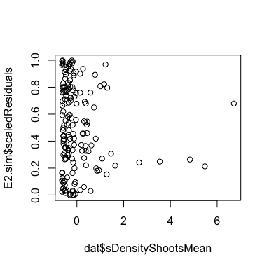
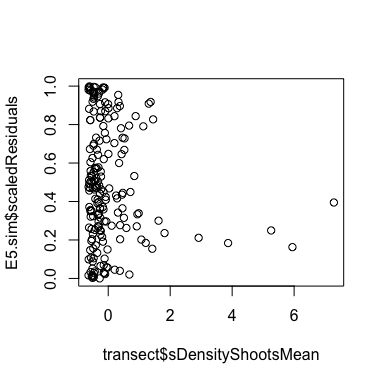
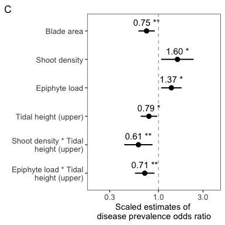
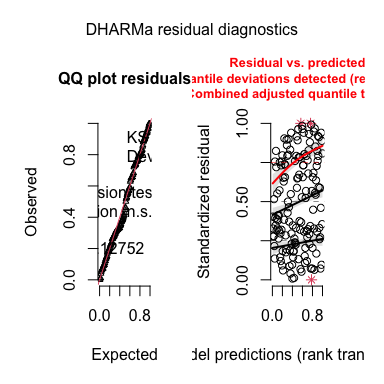
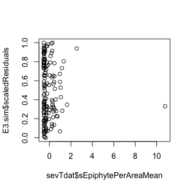
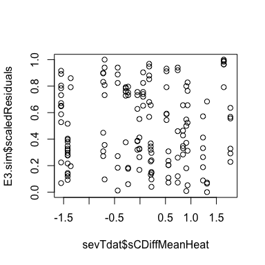
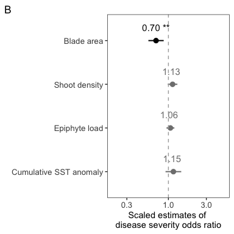
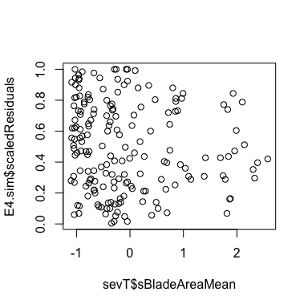
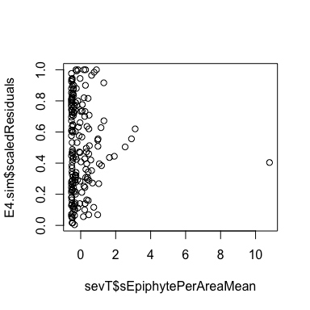
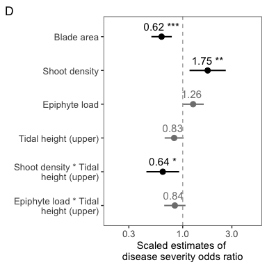

Transect\_glmm
================
LRA
1/26/2021

## Transect level models of disease

Two sets of models, one with cumulative positive temperature anomaly as
a predictor, one without.

Best models are selected based on AIC and model weight within the model
set.

Because only 27 meadows out of 32 have SST data for the anomaly
calculation, the number of replicates is smaller for those models.

However, the significant effects are mainly the same across the models.

Predictors are: Blade Area, Shoot Density, Epiphyte Mass per Blade Area,
Cumulative positive anomaly, Tidal Height, and all interactions between
Tidal Height and fixed effects.

Random structure for transects is Meadow within Region. For the
restircted dataset (SST sites only), Region as a random effect causes a
singular model (not enough variaiton in Region, also the design is
highly unbalanced). Therefore for those models, Region is not included.

Note, for severity, transect-level severity is summarized based on
diseased blades only. Predictor values are the same.

## Prevalence model with CPTA n=162

predictors: Density, Blade Area, Epiphyte mass per area, CPTA, Tidal
height, and interactions between fixed effects and TH random structure:
site within region

    ##              df      AIC  deltaAIC  likelihood      weight
    ## fit_prev2s   11 990.0088  1.712271 0.424800601 0.253592731
    ## fit_prev2.1s 10 988.2965  0.000000 1.000000000 0.596968862
    ## fit_prev2.2s 10 994.4903  6.193833 0.045188329 0.026976026
    ## fit_prev2.3s 10 992.0127  3.716173 0.155970825 0.093109726
    ## fit_prev2.4s 10 994.8368  6.540255 0.038001581 0.022685761
    ## fit_prev2.5s  7 999.7495 11.452974 0.003258504 0.001945226
    ## fit_prev2.6s  6 997.9759  9.679406 0.007909404 0.004721668

Based on AIC and model weights, best model is fit\_prev2.1s, second
model (no blade area:tidal height interaction)

Now need to validate the model and record output

<!-- --><!-- --><!-- --><!-- --><!-- -->

    ##  Family: binomial  ( logit )
    ## Formula:          
    ## PrevalenceMean ~ sBladeAreaMean + sDensityShootsMean + sEpiphytePerAreaMean +  
    ##     sCDiffMeanHeat + TidalHeight + sDensityShootsMean:TidalHeight +  
    ##     sEpiphytePerAreaMean:TidalHeight + sCDiffMeanHeat:TidalHeight +  
    ##     (1 | Meadow)
    ## Data: dat
    ## Weights: CountBlades
    ## 
    ##      AIC      BIC   logLik deviance df.resid 
    ##    988.3   1019.2   -484.1    968.3      152 
    ## 
    ## Random effects:
    ## 
    ## Conditional model:
    ##  Groups Name        Variance Std.Dev.
    ##  Meadow (Intercept) 1.186    1.089   
    ## Number of obs: 162, groups:  Meadow, 27
    ## 
    ## Conditional model:
    ##                                   Estimate Std. Error z value Pr(>|z|)    
    ## (Intercept)                        0.15711    0.22416   0.701  0.48339    
    ## sBladeAreaMean                    -0.11612    0.10800  -1.075  0.28230    
    ## sDensityShootsMean                 0.49850    0.22171   2.248  0.02455 *  
    ## sEpiphytePerAreaMean               0.25640    0.15270   1.679  0.09314 .  
    ## sCDiffMeanHeat                     0.90115    0.22518   4.002 6.28e-05 ***
    ## TidalHeightU                      -0.10492    0.11235  -0.934  0.35035    
    ## sDensityShootsMean:TidalHeightU   -0.55585    0.19374  -2.869  0.00412 ** 
    ## sEpiphytePerAreaMean:TidalHeightU -0.28188    0.14722  -1.915  0.05554 .  
    ## sCDiffMeanHeat:TidalHeightU       -0.25657    0.09629  -2.664  0.00771 ** 
    ## ---
    ## Signif. codes:  0 '***' 0.001 '**' 0.01 '*' 0.05 '.' 0.1 ' ' 1

    ## Warning in stats::dbinom(x, size = n, prob = mean): NaNs produced

    ## # Indices of model performance
    ## 
    ## AIC    |     BIC | R2 (cond.) | R2 (marg.) |  ICC | RMSE | Sigma | Log_loss
    ## ---------------------------------------------------------------------------
    ## 988.30 | 1019.17 |       0.36 |       0.13 | 0.26 | 0.15 |  1.00 |     0.13

    ## Scale for 'colour' is already present. Adding another scale for 'colour',
    ## which will replace the existing scale.

<!-- -->

Some issues with the uniformity of the simulated residuals, but there’s
not significant dispersion so it is probably okay to use the model.

Scaled odds ratio estimates indicate the change in odds of disease
prevalence, given a change of 1 SD of the predictor. E.g. for a given
transect, an increase of 1 SD of the cumulative SST anomaly means the
transect is 2.46 times more likely to be diseased.

## Transect-level prevalence model, for all transects, no CPTA, n=192

    ##             df      AIC   deltaAIC  likelihood      weight
    ## fit_prev5   10 1150.207  0.2247488 0.893709597 0.420376992
    ## fit_prev5.1  9 1149.983  0.0000000 1.000000000 0.470373144
    ## fit_prev5.2  9 1153.575  3.5925153 0.165918657 0.078043680
    ## fit_prev5.3  9 1155.716  5.7332801 0.056889752 0.026759411
    ## fit_prev5.4  7 1160.502 10.5198914 0.005195587 0.002443864
    ## fit_prev5.5  6 1160.900 10.9178524 0.004258126 0.002002908

By AIC and weight, model 5.1 is the best-fitting (no blade area
interaction with tidal height).

<!-- --><!-- --><!-- --><!-- -->

    ##  Family: binomial  ( logit )
    ## Formula:          
    ## PrevalenceMean ~ sBladeAreaMean + sDensityShootsMean + sEpiphytePerAreaMean +  
    ##     TidalHeight + sDensityShootsMean:TidalHeight + sEpiphytePerAreaMean:TidalHeight +  
    ##     +(1 | Region) + (1 | Meadow)
    ## Data: transect
    ## Weights: CountBlades
    ## 
    ##      AIC      BIC   logLik deviance df.resid 
    ##   1150.0   1179.3   -566.0   1132.0      183 
    ## 
    ## Random effects:
    ## 
    ## Conditional model:
    ##  Groups Name        Variance Std.Dev.
    ##  Region (Intercept) 0.6326   0.7954  
    ##  Meadow (Intercept) 1.1521   1.0733  
    ## Number of obs: 192, groups:  Region, 6; Meadow, 32
    ## 
    ## Conditional model:
    ##                                   Estimate Std. Error z value Pr(>|z|)   
    ## (Intercept)                         0.2071     0.3835   0.540  0.58923   
    ## sBladeAreaMean                     -0.2938     0.1029  -2.855  0.00430 **
    ## sDensityShootsMean                  0.4680     0.2044   2.290  0.02203 * 
    ## sEpiphytePerAreaMean                0.3179     0.1284   2.475  0.01330 * 
    ## TidalHeightU                       -0.2363     0.1036  -2.279  0.02264 * 
    ## sDensityShootsMean:TidalHeightU    -0.4955     0.1778  -2.787  0.00533 **
    ## sEpiphytePerAreaMean:TidalHeightU  -0.3394     0.1225  -2.771  0.00558 **
    ## ---
    ## Signif. codes:  0 '***' 0.001 '**' 0.01 '*' 0.05 '.' 0.1 ' ' 1

    ## Warning in stats::dbinom(x, size = n, prob = mean): NaNs produced

    ## # Indices of model performance
    ## 
    ## AIC     |     BIC | R2 (cond.) | R2 (marg.) |  ICC | RMSE | Sigma | Log_loss
    ## ----------------------------------------------------------------------------
    ## 1149.98 | 1179.30 |       0.37 |       0.02 | 0.35 | 0.15 |  1.00 |     0.13

    ## Scale for 'colour' is already present. Adding another scale for 'colour',
    ## which will replace the existing scale.

<!-- -->
Scaled odds ratio estimates indicate the change in odds of disease
prevalence, given a change of 1 SD of the predictor. E.g. for a given
transect, an increase of 1 SD of the shoot density means the transect is
1.7 times more likely to be diseased.

Same parameter estimates for the models with and without CPTA
(restricted vs not restricted), but restricted model has a higher
marginal R2. Therefore, temperature is perhaps important for explaining
the prevalence dynamics.

## Transect level severity with CPTA n = 155

    ##             df       AIC  deltaAIC likelihood     weight
    ## fit_sev3    12 -493.3983 2.9119568 0.23317212 0.07303044
    ## fit_sev3.1s 11 -495.3410 0.9692275 0.61593507 0.19291334
    ## fit_sev3.2s 11 -490.1408 6.1694043 0.04574366 0.01432710
    ## fit_sev3.3s 11 -494.3652 1.9450296 0.37813092 0.11843212
    ## fit_sev3.4s 11 -494.9780 1.3322317 0.51370000 0.16089290
    ## fit_sev3.5s  8 -494.5081 1.8021870 0.40612532 0.12720008
    ## fit_sev3.6s  7 -496.3103 0.0000000 1.00000000 0.31320402

By AIC and weight, the best model is fit\_sev3.6 (no tidal height and no
interactions)

<!-- --><!-- --><!-- --><!-- --><!-- --><!-- -->

    ##  Family: beta  ( logit )
    ## Formula:          
    ## SeverityMean ~ sBladeAreaMean + sDensityShootsMean + sEpiphytePerAreaMean +  
    ##     sCDiffMeanHeat + (1 | Meadow)
    ## Data: sevTdat
    ## 
    ##      AIC      BIC   logLik deviance df.resid 
    ##   -496.3   -475.0    255.2   -510.3      148 
    ## 
    ## Random effects:
    ## 
    ## Conditional model:
    ##  Groups Name        Variance Std.Dev.
    ##  Meadow (Intercept) 0.2612   0.5111  
    ## Number of obs: 155, groups:  Meadow, 27
    ## 
    ## Overdispersion parameter for beta family (): 22.8 
    ## 
    ## Conditional model:
    ##                      Estimate Std. Error z value Pr(>|z|)    
    ## (Intercept)          -2.53190    0.11957 -21.174  < 2e-16 ***
    ## sBladeAreaMean       -0.35832    0.11303  -3.170  0.00152 ** 
    ## sDensityShootsMean    0.12122    0.07062   1.717  0.08605 .  
    ## sEpiphytePerAreaMean  0.05832    0.05813   1.003  0.31567    
    ## sCDiffMeanHeat        0.14383    0.11591   1.241  0.21466    
    ## ---
    ## Signif. codes:  0 '***' 0.001 '**' 0.01 '*' 0.05 '.' 0.1 ' ' 1

    ## # Indices of model performance
    ## 
    ## AIC     |     BIC | R2 (cond.) | R2 (marg.) |  ICC | RMSE | Sigma
    ## -----------------------------------------------------------------
    ## -496.31 | -475.01 |       0.53 |       0.21 | 0.40 | 0.06 | 22.84

    ## Scale for 'colour' is already present. Adding another scale for 'colour',
    ## which will replace the existing scale.

<!-- -->
In contrast to prevalence models, severity model is beta regression, so
the scaled parameter estimates estimate the change in the ratio of
proportions, rather than the ratio of probabilities (odds). E.g. for an
increase in leaf area of 1 SD, the ratio of diseased to non-diseased
tissue will change by a factor of 0.70. Only leaf area is significant;
effect sizes are smaller and non-significant for other predictors,
including cumulative SST anomaly.

## Transect level severity without CPTA n = 183

    ##            df       AIC deltaAIC likelihood     weight
    ## fit_sev4   10 -575.7107 1.963471 0.37466031 0.14728232
    ## fit_sev4.1  9 -577.6741 0.000000 1.00000000 0.39310894
    ## fit_sev4.2  9 -572.4198 5.254382 0.07228122 0.02841439
    ## fit_sev4.3  9 -575.6747 1.999453 0.36798014 0.14465628
    ## fit_sev4.4  7 -575.4558 2.218340 0.32983258 0.12966014
    ## fit_sev4.5  6 -575.8369 1.837238 0.39906986 0.15687793

By AIC and weight, best model is fit\_sev4.1, no blade area: tidal
height interaction

<!-- --><!-- --><!-- --><!-- --><!-- -->

    ##  Family: beta  ( logit )
    ## Formula:          
    ## SeverityMean ~ sBladeAreaMean + sDensityShootsMean + sEpiphytePerAreaMean +  
    ##     TidalHeight + sDensityShootsMean:TidalHeight + sEpiphytePerAreaMean:TidalHeight +  
    ##     (1 | Meadow)
    ## Data: sevT
    ## 
    ##      AIC      BIC   logLik deviance df.resid 
    ##   -577.7   -548.8    297.8   -595.7      174 
    ## 
    ## Random effects:
    ## 
    ## Conditional model:
    ##  Groups Name        Variance Std.Dev.
    ##  Meadow (Intercept) 0.3219   0.5674  
    ## Number of obs: 183, groups:  Meadow, 32
    ## 
    ## Overdispersion parameter for beta family (): 25.5 
    ## 
    ## Conditional model:
    ##                                   Estimate Std. Error z value Pr(>|z|)    
    ## (Intercept)                        -2.3891     0.1295 -18.454  < 2e-16 ***
    ## sBladeAreaMean                     -0.4725     0.1164  -4.059 4.93e-05 ***
    ## sDensityShootsMean                  0.5576     0.2067   2.698  0.00698 ** 
    ## sEpiphytePerAreaMean                0.2326     0.1212   1.919  0.05493 .  
    ## TidalHeightU                       -0.1913     0.1084  -1.765  0.07758 .  
    ## sDensityShootsMean:TidalHeightU    -0.4462     0.1865  -2.392  0.01675 *  
    ## sEpiphytePerAreaMean:TidalHeightU  -0.1757     0.1213  -1.449  0.14746    
    ## ---
    ## Signif. codes:  0 '***' 0.001 '**' 0.01 '*' 0.05 '.' 0.1 ' ' 1

    ## # Indices of model performance
    ## 
    ## AIC     |     BIC | R2 (cond.) | R2 (marg.) |  ICC | RMSE | Sigma
    ## -----------------------------------------------------------------
    ## -577.67 | -548.79 |       0.63 |       0.29 | 0.48 | 0.05 | 25.52

    ## Scale for 'colour' is already present. Adding another scale for 'colour',
    ## which will replace the existing scale.

<!-- -->

Scaled estimates indicate change in the ratio of diseased tissue to
non-diseased tissue. For a 1 SD increase in shoot density, the ratio of
diseased tissue to non-diseased tissue changes by a factor of 1.84.

Same estimate for leaf area but for the unrestricted dataset (all
transects), shoot density is significant.
