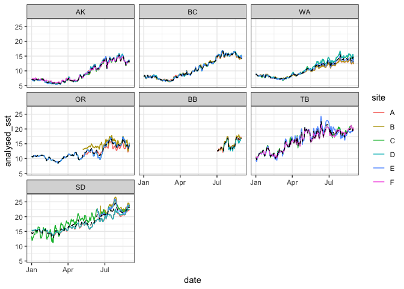
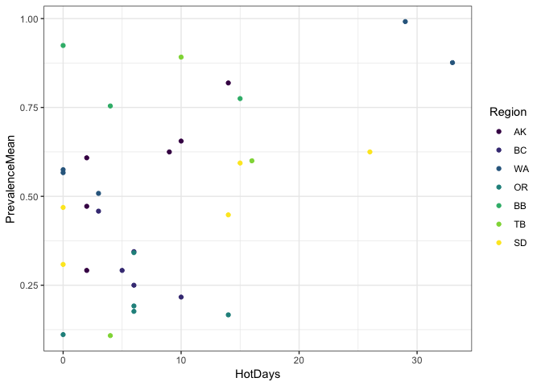
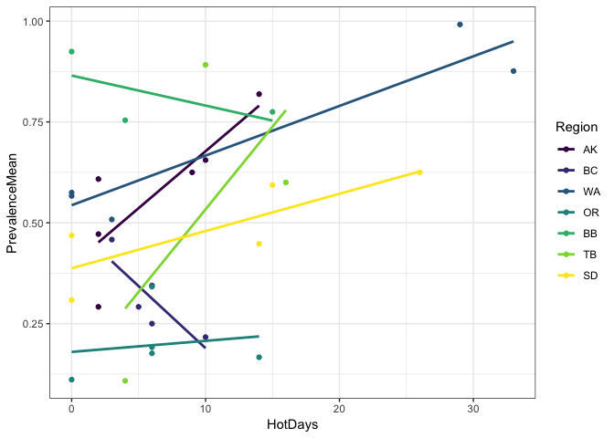

RelativeTempDisease
================
LRA
9/24/2020

### Quick summary of relative temperature metrics

Here I am trying to model the effects of temperature on disease across
the latitudinal scale. There’s no relationship between any absolute
temperature metric and disease levels.

Proposed metric is number of hot days in Summer (July and August) that
are hot within the region

<!-- -->

    ## # A tibble: 20 x 14
    ## # Groups:   region [?]
    ##    region season   min fifth tenth    Q1   med  mean    Q3 eighty ninety
    ##    <ord>  <chr>  <dbl> <dbl> <dbl> <dbl> <dbl> <dbl> <dbl>  <dbl>  <dbl>
    ##  1 AK     Spring  6.46  6.57  6.64  7.66  9.32  9.63 11.2   11.6   13.0 
    ##  2 AK     Summer 10.9  12.6  12.9  13.2  13.5  13.7  14.4   14.7   14.9 
    ##  3 AK     Winter  5.57  5.66  5.77  5.97  6.54  6.52  7.02   7.07   7.15
    ##  4 BC     Spring  8.32  8.73  8.83  9.70 11.2  11.2  12.7   12.9   13.4 
    ##  5 BC     Summer 14.1  14.4  14.6  14.9  15.4  15.4  15.8   16.0   16.4 
    ##  6 BC     Winter  6.50  6.60  6.66  6.86  7.69  7.57  8.11   8.19   8.43
    ##  7 WA     Spring  8.31  8.60  8.89  9.61 10.8  10.8  12.0   12.2   12.7 
    ##  8 WA     Summer 12.2  12.4  12.6  13.2  13.8  13.7  14.2   14.3   14.6 
    ##  9 WA     Winter  6.97  7.25  7.31  7.51  7.86  7.97  8.43   8.54   8.69
    ## 10 OR     Spring  9.56  9.90 10.2  11.2  11.9  12.0  12.7   12.9   13.4 
    ## 11 OR     Summer 13.2  13.7  14.0  14.6  15.0  15.1  15.6   15.9   16.5 
    ## 12 OR     Winter  8.45  8.89  9.00  9.50 10.4  10.2  10.9   10.9   11.1 
    ## 13 BB     Spring 12.4  12.5  12.5  12.6  12.8  12.8  13.0   13.0   13.1 
    ## 14 BB     Summer 12.5  12.8  13.0  13.7  14.3  14.9  16.4   16.6   16.9 
    ## 15 TB     Spring 14.3  15.5  15.8  16.6  18.6  18.3  19.7   19.7   21.1 
    ## 16 TB     Summer 17.2  17.7  18.0  18.4  18.8  19.0  19.7   19.7   19.9 
    ## 17 TB     Winter  9.55 10.1  10.5  11.2  12.3  12.6  14.0   14.4   15.7 
    ## 18 SD     Spring 16.3  16.8  17.0  17.3  18.2  18.5  19.8   20.1   20.5 
    ## 19 SD     Summer 20.7  21.3  21.4  21.6  22.0  22.2  22.8   23.0   23.5 
    ## 20 SD     Winter 12.8  13.5  14.0  14.4  15.1  15.1  15.8   15.9   16.2 
    ## # … with 3 more variables: ninetyfive <dbl>, max <dbl>, range <dbl>

## HotDays

Comparing disease levels based on the number of days above the 90th
percentile within a
region

<!-- --><!-- -->

This is a relative temperature metric that puts all the sites on the
same temperature scale. But it is relative within regeions, and would be
a lot better based on long-term climatology versus one summer.

Also, BB and TB only have 3 sites each, which is pretty limiting.
