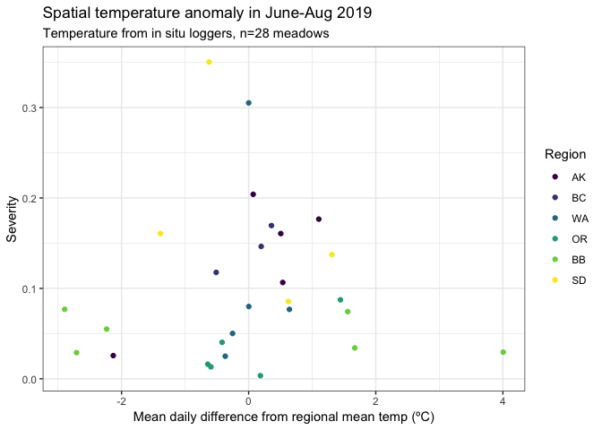
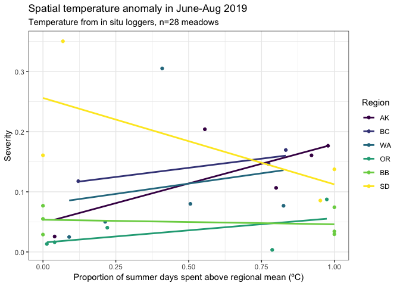

RelativeTempDiseaseHOBO
================
LRA
9/30/2020

## Spatial temperature anomaly and disease

Here I am using the in situ temperatures to determine if sites that are
hotter locally, i.e. compared to other sites within the same region,
have higher rates of disease.

Using all the HOBO data from JJA of 2019. Combined upper and lower tidal
heights, as there’s little consistent variation between
them.

<!-- --><!-- -->

#### July and August

Focus on July and August (temp records for June are incomplete)

Potential metrics of spatial temperature anomaly: 1) Mean daily
difference between site temps and the regional mean 2) Proportion of
days in July and Aug spent with daily temp above the regional mean

Note, use the proportion of days out of days when in situ loggers were
deployed so that sites with longer records aren’t biased.

Can calculate the same as above for 90th percentile instead of regional
mean

<!-- --><!-- --><!-- --><!-- --><!-- --><!-- --><!-- --><!-- -->

No overall pattern with spatial temperature anomaly metrics and disease.
In WA and AK, sites that are warm for the region do show an increase in
prevalence, but for other regions, the pattern disappears.

So, a spatial anomaly may be important in some regions but no uniform
effect.

Removing BB\_E (exceptionally warm for its region) doesn’t change
patterns.

Plots are not shown for 90th percentile metrics, but the lack of pattern
is the same as for the metrics shown.

#### JJA

These are the same plots but using summer temperatures from the period
June-Aug. More uneven betwen regions, but still don’t see any
patterns.

<!-- --><!-- --><!-- --><!-- --><!-- --><!-- --><!-- --><!-- -->

Overall, we see no indication that spatial temperature anomalies can
explain disease across regions.

I don’t plan to present any models to explain these non-patterns.

Overall
