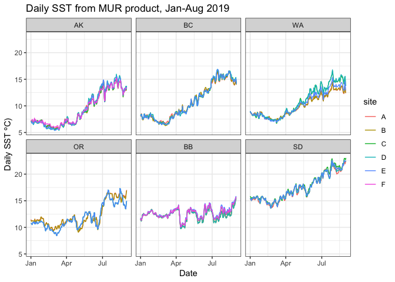
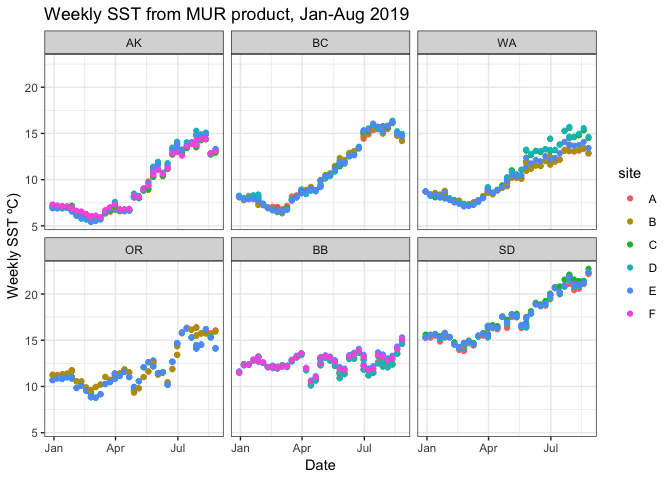
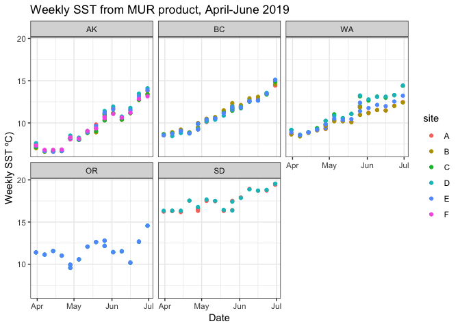
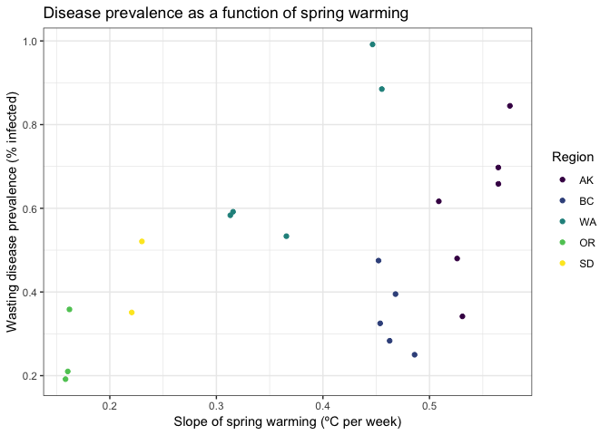
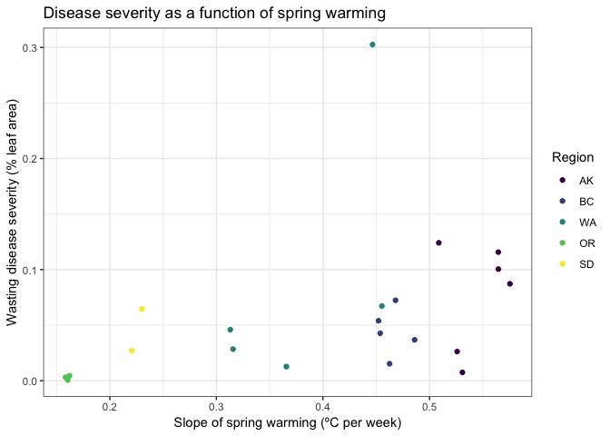
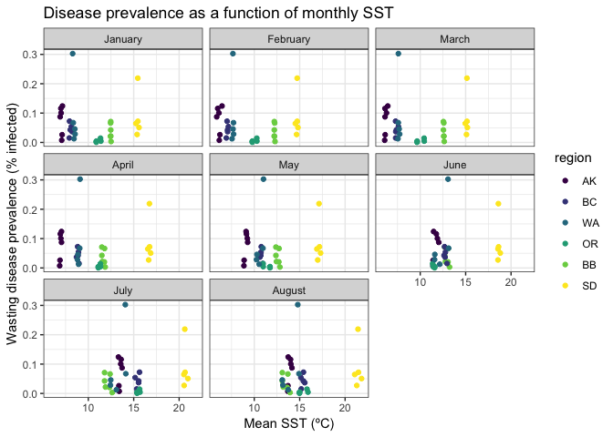
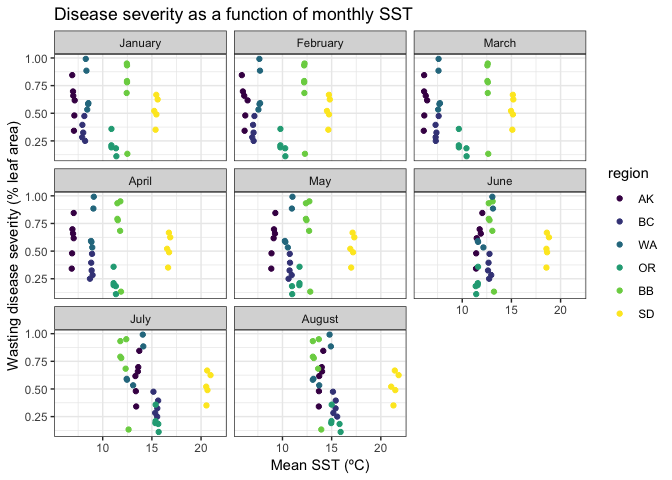
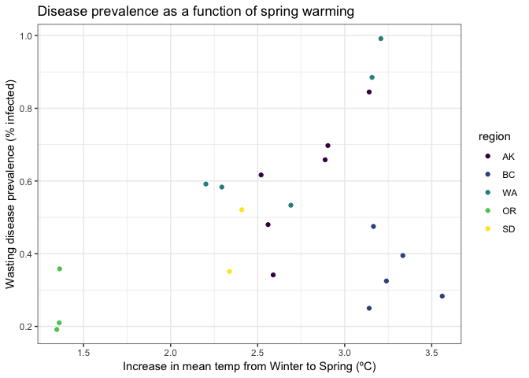
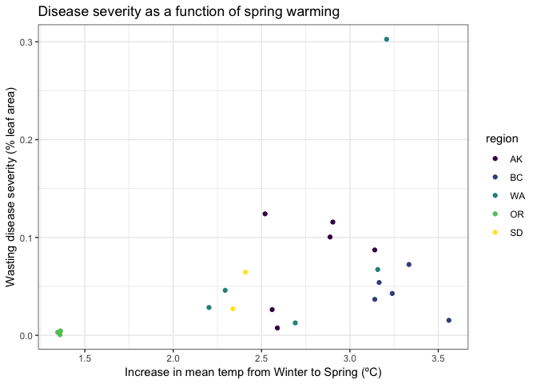

MURTempExp
================
LRA
4/17/2020

## Data exploration with SST from MUR data product

# Daily SST

<!-- -->

Key caveat - all BB sites are offshore, hence the cooler and less
seasonal temperatures are not accurate for seagrass sites. Two OR and
three SD sites are also offshore. We do not have any HOBO data for this
period (Jan-Aug 2019) but we may be able to find some buoy or other data
to supplement for at least some BB sites.

If we plot at weekly intervals, we can see seasonal patterns more
clearly. <!-- -->

Focus on spring (April, May June) as a period of rapid temperature
increase at most sites, with temps plateauing during later summer
(except maybe in SD).

Also, eliminate meadows that are offshore (11) leaving n=21 meadows in
the remaining data
set.

## Spring temps

<!-- --><!-- --><!-- -->

There’s clear differentiation in spring warming rates between regions,
and between sites within regions. WA.C is Beach Haven - warms up really
fast and is the highest disease in the project.

Fairly nice relationship between spring warming rate and prevalence and
severity. It would be really good to get the 11 missing values on these
plots.

## Seasonal change

We can also look at temps by month to see if there are strong patterns
in any
month.

<!-- --><!-- -->

No relationships between disease metrics and monthly mean temperatures.

However, as an alternative to the spring warming rate, we can look at
the change from Winter (Jan-March) to Spring (April-June)
temps.

<!-- --><!-- -->

A couple observations: BC is somewhat out of the general pattern between
the other sites. Relationship is more clear for prevalence, whereas
severity, without Beach Haven (WA.C), the relationship is minimal.
