MURTempExp
================
LRA
4/17/2020

## Data exploration with comparing water temperature and disease

# Daily temperature dataset

We collected SST from MUR satellite data (1 km resolution) for 21 of the
32 sites (meadows). For the other 11 sites (in OR, BB, and SD), the
closest SST pixel was offshore and not useable.

In the plots below, I supplemented the two missing OR sites with
temperature data from a nearby NEER monitoring station (~1-2 km from the
meadows). For three of the sites in Tomales Bay, we had some
temperatures from in situ measurements by Jay’s student Katie DuBois. We
also used temperatures from 2017-2018 at the sites and a nearby buoy
(run by BML) to predict 2019 site temperatures from the 2019 buoy
temperatures. For the missing SD sites, we are still working on finding
alternative temperature sources. So we are still missing 6 sites out of
32.

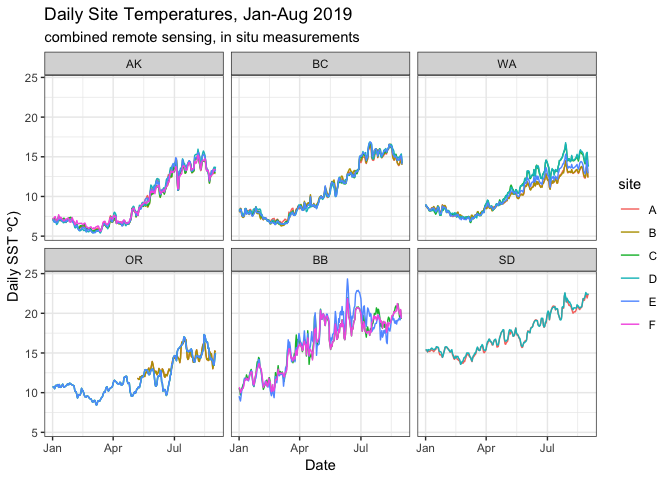<!-- -->

If we plot at weekly intervals, we can see seasonal patterns more
clearly.

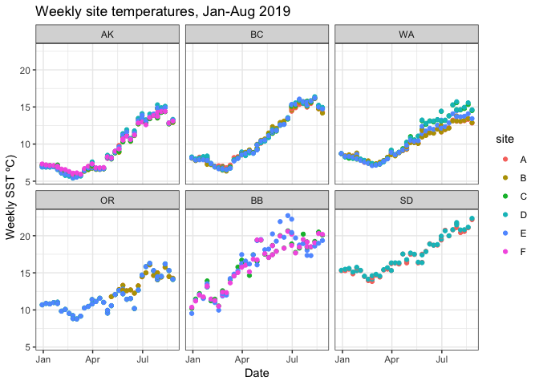<!-- -->

There are clear regional trends in absolute temperature and in seasonal
temperature patterns. Ane site-specific temperature differences.

## Monthly temperatures

We can look at average monthly temperatures to see if there are any
strong patterns in absolute
temperature.

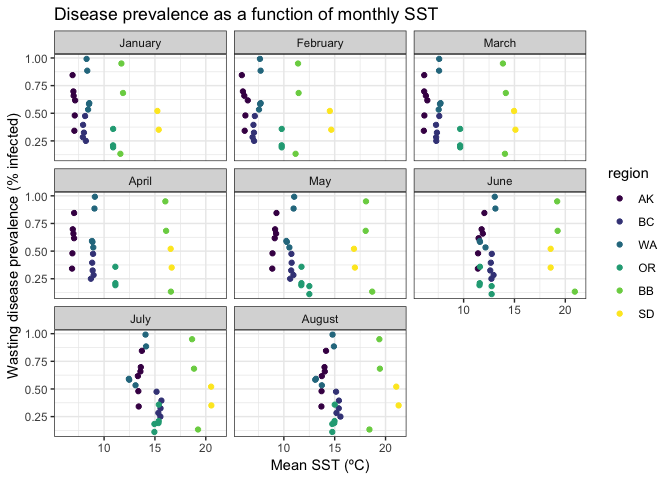<!-- -->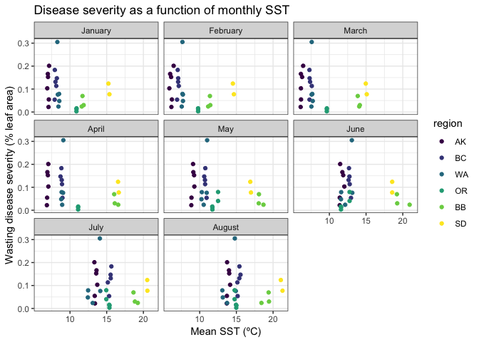<!-- -->

No clear relationships between disease metrics and monthly mean
temperatures. Absolute temperatures have a wide range across the
geographic scale of the study, so it’s tricky to compare absolute
temperatures between regions. But, we can look at relative temperature
metrics.

I compared disease with three relative temperature metrics:

1)  Rate of spring warming (increase in weekly temperature from
    April-June, ºC per week)
2)  Winter cooling (change in monthly temperature from Jan to Feb, ºC).
3)  Summer warming (change in monthly temperature from June to July,
    ºC).

## Spring warming

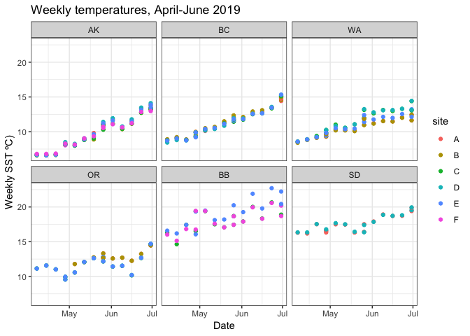<!-- -->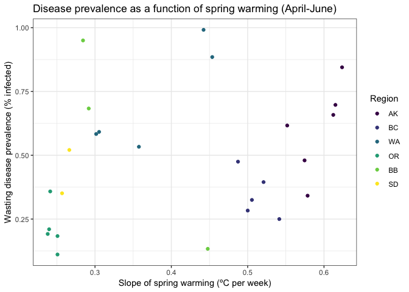<!-- -->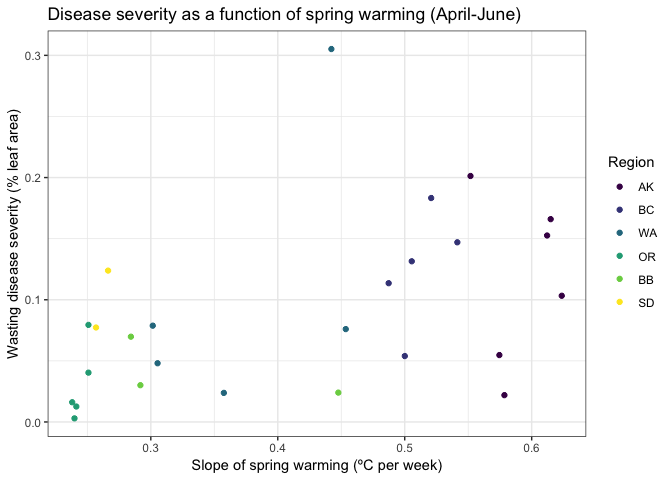<!-- -->

There’s clear differentiation in spring warming rates between regions,
and between sites within regions. WA\_C is Beach Haven - warms up really
fast and is the highest disease prevalence in the project.

Prevalence increaes with spring warming but there seems to be
differentiation between regions - AK and BC are clustered on a different
trend that the other sites. Note the outlier BB site (high rate of
warming, minimal disease) - that’s BB\_E, Millerton.

Severity also increases with spring warming, but the relationship is
weaker and the geographic split is not obvious.

Note, that the relationship is driven by warming over the entire period
(April 1 - June 30). Splitting into smaller periods, e.g. months or
April-May, doesn’t show this kind of relationship.

## Winter cooling

Temperatures tend to decline during winter (Jan to Feb) with the coldest
days in Feb. However, not all sites show a consistent decline (in
contrast to spring, when all sites show pretty consistent warming). So,
rather than use the slope of weekly temperatures during Jan and Feb, I
used the simple change in temps: mean Jan temp subtracted from the mean
Feb temp. More negative values mean February was cooler than
January.

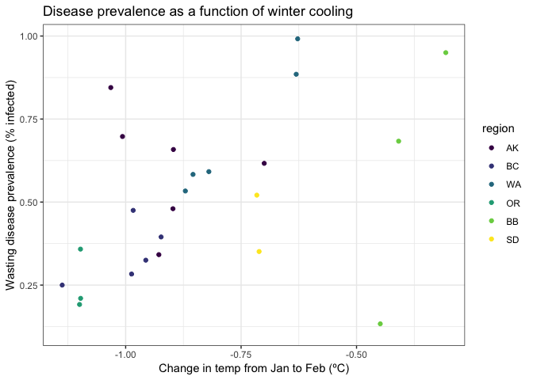<!-- -->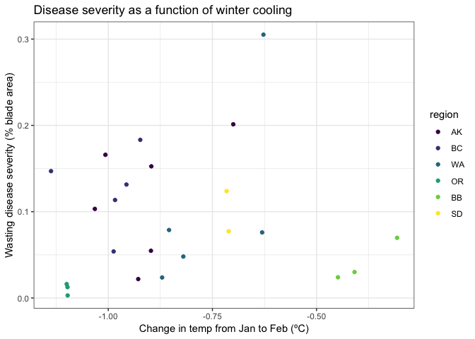<!-- -->

Prevalence tends to increase as the winter temperatures become more
constant. I.e. sites where Feb is not much colder than Jan have higher
prevalence. But, there’s a lot of noise, and note the outlier is BB\_E
again.

Severity doesn’t show any trend with winter cooling.

## Summer warming

Summer temperatures are similar to winter in that there’s warming at
some sites, but it’s not consistent through time. Note that here I’m
considering Summer to be June and July - since we sampled before Aug, I
didn’t consider the Aug temperatures.

Here I used the change in temperature from June to July, i.e. July mean
minus June mean. Values close to zero mean temps were consistent in June
and July; larger values mean July was warmer than
June.

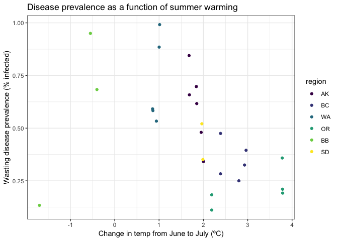<!-- -->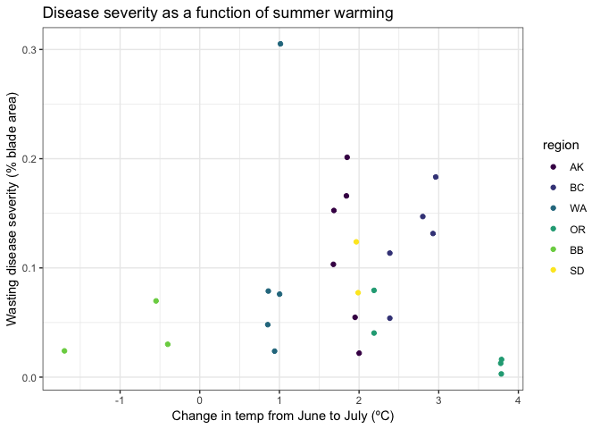<!-- -->

Looks like Prevalence has a consistent, logistic relationship, with
sites that experience a big temperature change from June to July having
less disease than sites that have similar temps in June and July. This
may see counterintuitive, but consider that consistent temperatures in
June and July means that warm summer temperatures are reached early in
the summer. A big increase from June to July could suggest a very hot
July or could suggest that early summer is still a relatively cool
period.

Severity has no trend.

## Conclusions

All three measure of relative temperature show trends with Prevalence
and weak or no trends with Severity.

Preliminary modeling suggests that spring warming is a significant
predictor of disease prevalence, and that winter cooling and summer
warming are not significant.

Models also suggest there is a geographic split, with different patterns
in AK and BC compared to the other sites.
