SpringWarmingModel
================
LRA
9/29/2020

### Spring warming model

Here I use beta regression to model disease prevalence as a function of
spring warming rates, i.e. weekly increase in temperature from
April-June

Temperature data are mostly from MUR SST (n=21 meadows) but some are
from in situ sources (n=5)

BB\_E is excluded - if BB\_E is included, there is no significant effect
of the model.

Here, I’m showing a final model that separates out two superregions - AK
and BC together and other sites are grouped together.

Note the main difference between these regions is due to colder winters
in AK and BC - they warm up faster to get to similar temps to WA/OR in
summer.

    ## 
    ## Call:
    ## betareg(formula = PrevalenceMean ~ slope + SuperRegion, data = alldat[alldat$meadow != 
    ##     "BB_E", ], link = "logit")
    ## 
    ## Standardized weighted residuals 2:
    ##     Min      1Q  Median      3Q     Max 
    ## -2.0823 -0.6909 -0.0120  0.4017  2.9325 
    ## 
    ## Coefficients (mean model with logit link):
    ##              Estimate Std. Error z value Pr(>|z|)    
    ## (Intercept)   -7.8858     1.4547  -5.421 5.93e-08 ***
    ## slope         13.8670     2.5815   5.372 7.80e-08 ***
    ## SuperRegionS   3.9086     0.7615   5.133 2.85e-07 ***
    ## 
    ## Phi coefficients (precision model with identity link):
    ##       Estimate Std. Error z value Pr(>|z|)    
    ## (phi)    7.859      2.086   3.767 0.000165 ***
    ## ---
    ## Signif. codes:  0 '***' 0.001 '**' 0.01 '*' 0.05 '.' 0.1 ' ' 1 
    ## 
    ## Type of estimator: ML (maximum likelihood)
    ## Log-likelihood: 13.59 on 4 Df
    ## Pseudo R-squared: 0.6053
    ## Number of iterations: 24 (BFGS) + 4 (Fisher scoring)

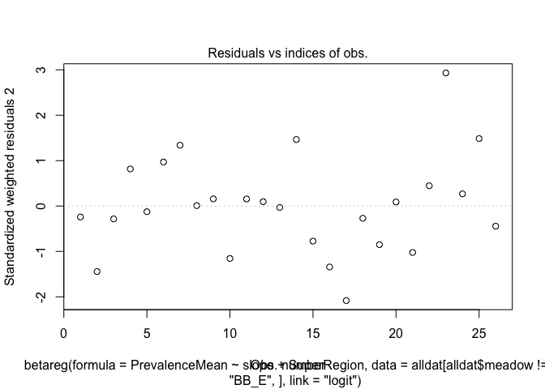<!-- -->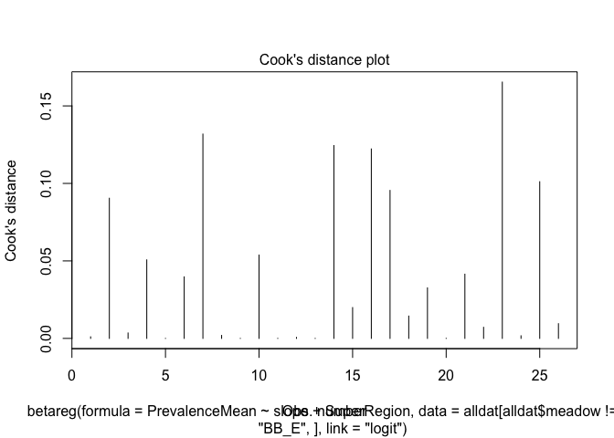<!-- -->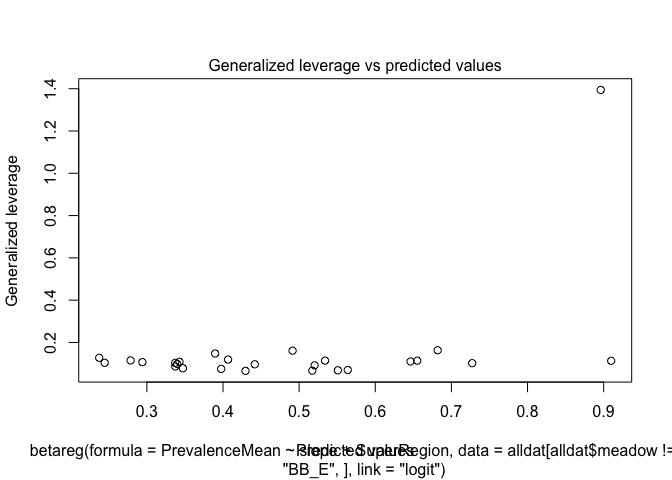<!-- -->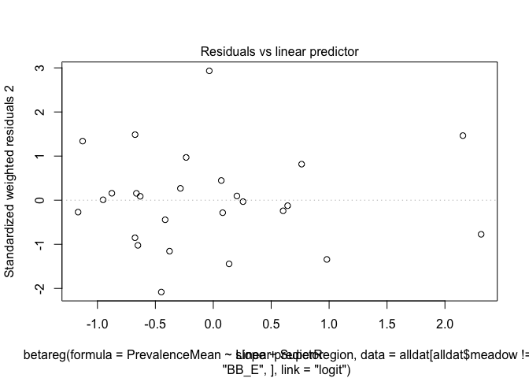<!-- -->

    ##         1         2         3         4         5         6         7 
    ## 0.6463074 0.5340687 0.5203315 0.6819473 0.6551656 0.4417613 0.2445592 
    ##         8         9        10        11        12        13        14 
    ## 0.2786183 0.2941055 0.4066841 0.3399259 0.5508348 0.5638378 0.8961443 
    ##        15        16        17        18        19        20        21 
    ## 0.9099012 0.7272655 0.3896470 0.2373808 0.3372022 0.3473541 0.3428250 
    ##        22        24        25        26        27 
    ## 0.5172734 0.4913840 0.4295233 0.3373845 0.3976121

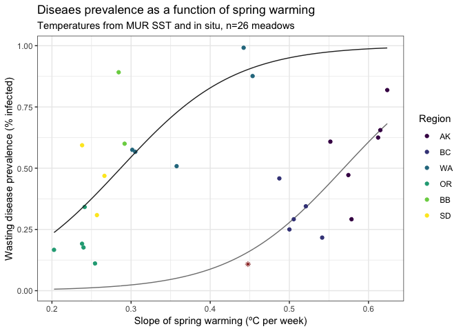<!-- -->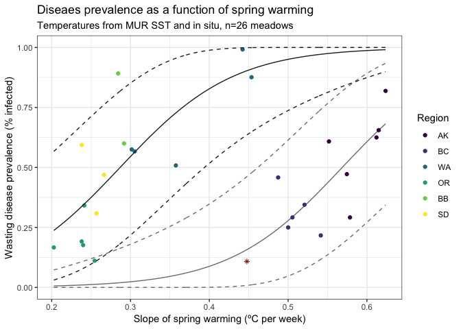<!-- -->

    ## 
    ## Call:
    ## betareg(formula = SeverityMean ~ slope, data = alldat[alldat$meadow != 
    ##     "BB_E", ], link = "logit")
    ## 
    ## Standardized weighted residuals 2:
    ##     Min      1Q  Median      3Q     Max 
    ## -2.5193 -0.6362  0.3300  0.7066  1.9570 
    ## 
    ## Coefficients (mean model with logit link):
    ##             Estimate Std. Error z value Pr(>|z|)    
    ## (Intercept)  -3.3594     0.4365  -7.696  1.4e-14 ***
    ## slope         2.6784     0.9252   2.895  0.00379 ** 
    ## 
    ## Phi coefficients (precision model with identity link):
    ##       Estimate Std. Error z value Pr(>|z|)    
    ## (phi)   19.997      5.699   3.509  0.00045 ***
    ## ---
    ## Signif. codes:  0 '***' 0.001 '**' 0.01 '*' 0.05 '.' 0.1 ' ' 1 
    ## 
    ## Type of estimator: ML (maximum likelihood)
    ## Log-likelihood: 39.75 on 3 Df
    ## Pseudo R-squared: 0.2511
    ## Number of iterations: 20 (BFGS) + 2 (Fisher scoring)

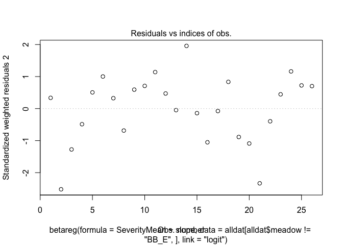<!-- -->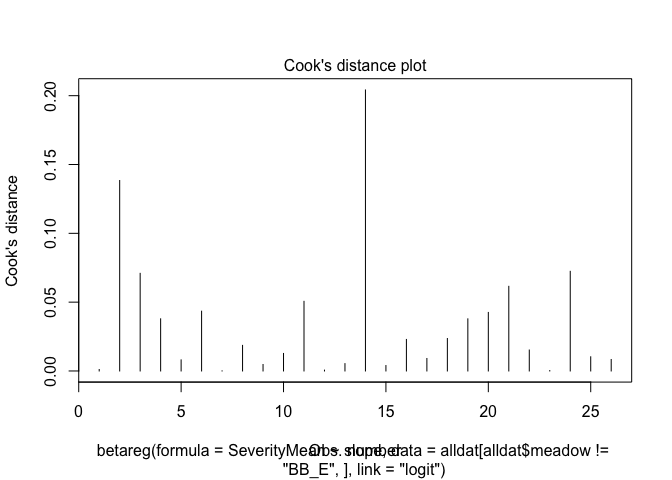<!-- -->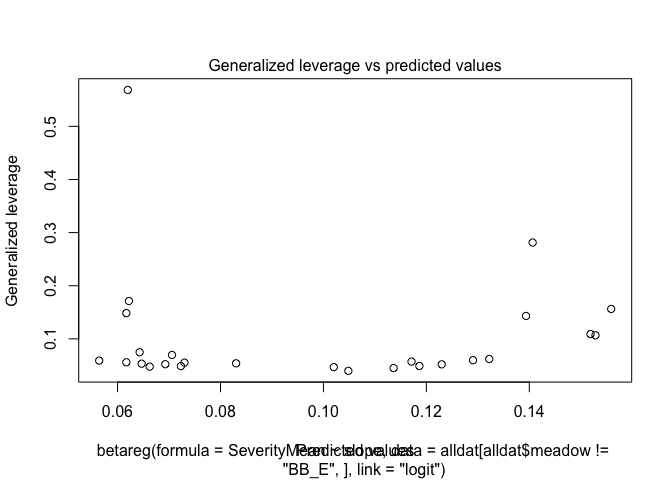<!-- -->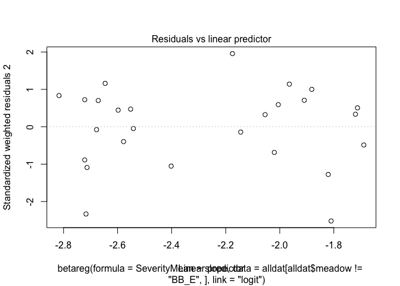<!-- -->

    ## $R2
    ## Pseudo R2 
    ## 0.2510961

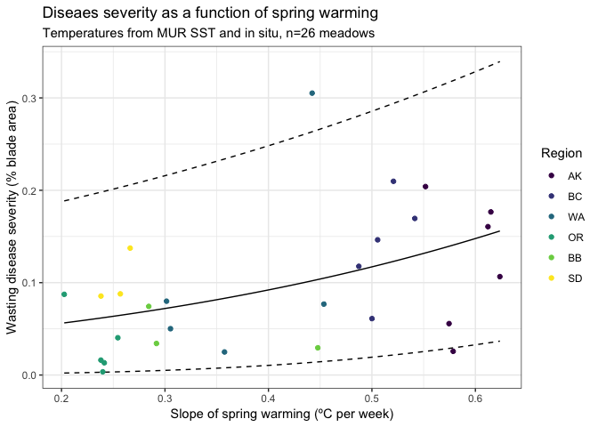<!-- -->
