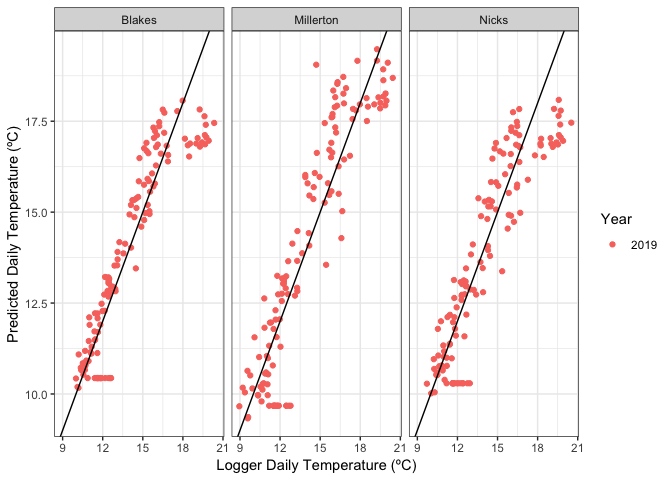
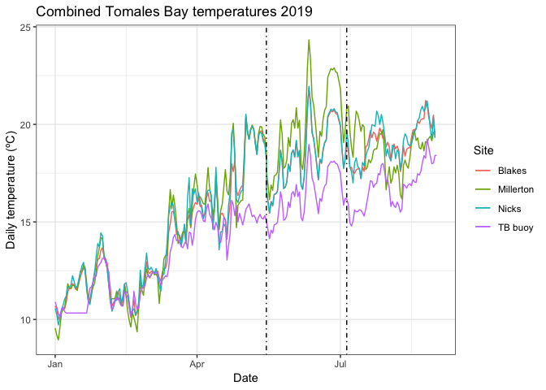

PredictingTomalesBayTemps
================
LRA
4/28/2020

### Using BOON buoy temperatures to predict site temperatures at Tomales Bay seagrass meadows

Analysis here uses three sources of temperature data:

1)  logger temperatures from Jay’s students from 2017-May 2019 at the
    Tomales Bay meadows

2)  buoy temperatures from the Tomales Bay buoy, maintained by BML, from
    2017-2019

3)  NSF HOBO logger temperatures from July-Aug 2019

I used the buoy temps and logger temps from the overlapping period
2017-May 2019 to calculate regression models to predict site
temperatures.

Then, I predicted site temperatures during the data gap (May 16-July 4
2019) using the buoy data.

One question is how comparable the other loggers and the NSF HOBO
loggers are - if they are subtidal vs intertidal, could change the
relationship with the buoys.

### Model summaries for site temp vs buoy temp

All three models are significant, R2 ~0.6-0.7

    ## 
    ## Call:
    ## lm(formula = LoggerHourly ~ BuoyHourly, data = BL)
    ## 
    ## Residuals:
    ##     Min      1Q  Median      3Q     Max 
    ## -8.8546 -0.9208 -0.2424  0.8054 12.9889 
    ## 
    ## Coefficients:
    ##              Estimate Std. Error t value Pr(>|t|)    
    ## (Intercept) -3.208503   0.094480  -33.96   <2e-16 ***
    ## BuoyHourly   1.320979   0.006684  197.64   <2e-16 ***
    ## ---
    ## Signif. codes:  0 '***' 0.001 '**' 0.01 '*' 0.05 '.' 0.1 ' ' 1
    ## 
    ## Residual standard error: 1.707 on 14209 degrees of freedom
    ## Multiple R-squared:  0.7333, Adjusted R-squared:  0.7333 
    ## F-statistic: 3.906e+04 on 1 and 14209 DF,  p-value: < 2.2e-16

    ## 
    ## Call:
    ## lm(formula = LoggerHourly ~ BuoyHourly, data = MP)
    ## 
    ## Residuals:
    ##      Min       1Q   Median       3Q      Max 
    ## -13.2032  -1.2046  -0.1023   1.2648  16.0190 
    ## 
    ## Coefficients:
    ##              Estimate Std. Error t value Pr(>|t|)    
    ## (Intercept) -7.858498   0.126283  -62.23   <2e-16 ***
    ## BuoyHourly   1.697445   0.008933  190.01   <2e-16 ***
    ## ---
    ## Signif. codes:  0 '***' 0.001 '**' 0.01 '*' 0.05 '.' 0.1 ' ' 1
    ## 
    ## Residual standard error: 2.282 on 14206 degrees of freedom
    ## Multiple R-squared:  0.7176, Adjusted R-squared:  0.7176 
    ## F-statistic: 3.61e+04 on 1 and 14206 DF,  p-value: < 2.2e-16

    ## 
    ## Call:
    ## lm(formula = LoggerHourly ~ BuoyHourly, data = NC)
    ## 
    ## Residuals:
    ##      Min       1Q   Median       3Q      Max 
    ## -10.0712  -1.1587  -0.3001   1.0419  14.1009 
    ## 
    ## Coefficients:
    ##              Estimate Std. Error t value Pr(>|t|)    
    ## (Intercept) -3.644898   0.124051  -29.38   <2e-16 ***
    ## BuoyHourly   1.349351   0.008776  153.76   <2e-16 ***
    ## ---
    ## Signif. codes:  0 '***' 0.001 '**' 0.01 '*' 0.05 '.' 0.1 ' ' 1
    ## 
    ## Residual standard error: 2.241 on 14209 degrees of freedom
    ## Multiple R-squared:  0.6246, Adjusted R-squared:  0.6246 
    ## F-statistic: 2.364e+04 on 1 and 14209 DF,  p-value: < 2.2e-16

<!-- -->

The predicted temperatures match well with the logger temperatures from
Jan-May 2019. However, there’s more spread (divergence from the 1:1
line) at higher temperatures.

### Comparing the 2019 temperature record

<!-- -->

Temperatures from Jan 1 - May 15 are from logger data (from Jay’s other
loggers)

Temperatures between the dashed lines (May 16 - July 4) are predicted
from the buoy temperatures.

Temperatures from July 5 - Aug 31 are from the NSF HOBO loggers.

Predictions are made at the hourly level and averaged for each day.

Some issues:

1)  During the prediction period, there’s more separation between
    Millerton and the other sites.

2)  Millerton is the hottest site consistently through the prediction
    period but not during the other periods.

3)  Steep drop in temps in mid-May (i.e. moving from the loggers to
    predicted temps).

But, the July temperatures don’t have a big jump when moving back from
predictions to loggers, and the spread between the buoy and site temps
during the prediction period seems consistent with the July-Aug period.

A couple other notes:

I tried modeling site temps from buoy temps during only the “gap”
(May-June 2017-2019). However, the linear relationship between hourly
site temps and hourly buoy temps from just the May-June period is really
weak (R2 \<0.1). I think this suggests that there’s a lot of variability
in spring that means the buoy temp is a worse predictor of site-level
temps than during other periods (e.g. winter). That’s not very
surprising, but is unfortunate if we want to use spring temperatures as
a predictor of disease.

An alternative to predicting site temps from buoy temps is to accept the
gap in the temp data (May 16-July 4) at the Tomales sites. If we have
permission to uses these other loggers (from Katie DuBois?), we have
*some* spring and summer temps, so we can use that more limited dataset
for the 2019 disease modeling.
