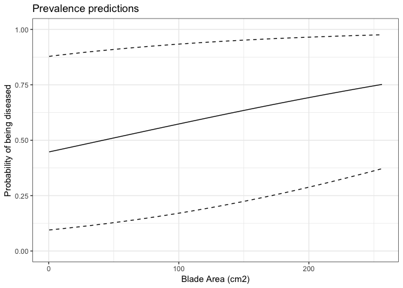
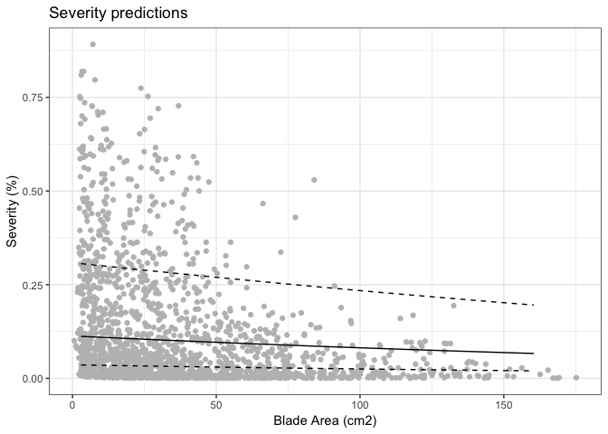

Disease Models 1
================
LRA
4/13/2020

## Modeling seagrass wasting disease

Here, I modeled seagrass wasting disease using a GLMM hurdle model
approach.

Underlying data were from the 2019 NSF surveys. 3702 individual blades
were scanned for disease prevalence and severity.

Explanatory factors were Tidal Height, Shoot Density, and Blade Area.
From earlier work in the SJI, we would expect that disease prevalence
and severity would increase with larger blade areas and greater shoot
densities.

Random effects were MeadowId (site within region). I also looked at
effect of grouping by region.

\*Note, this markdown file doesn’t include all details of the model
selection and validation process, for simplicity in sharing results

    ##  Family: binomial  ( logit )
    ## Formula:          
    ## Prevalence ~ sBladeArea + sDensityShoots + TidalHeight + (1 |  
    ##     MeadowId)
    ## Data: bladeWD
    ## 
    ##      AIC      BIC   logLik deviance df.resid 
    ##   4219.9   4251.0  -2105.0   4209.9     3697 
    ## 
    ## Random effects:
    ## 
    ## Conditional model:
    ##  Groups   Name        Variance Std.Dev.
    ##  MeadowId (Intercept) 1.88     1.371   
    ## Number of obs: 3702, groups:  MeadowId, 32
    ## 
    ## Conditional model:
    ##                 Estimate Std. Error z value Pr(>|z|)    
    ## (Intercept)    -0.004324   0.249862  -0.017 0.986192    
    ## sBladeArea      0.226840   0.066422   3.415 0.000638 ***
    ## sDensityShoots -0.042782   0.060745  -0.704 0.481258    
    ## TidalHeightU    0.150309   0.087006   1.728 0.084063 .  
    ## ---
    ## Signif. codes:  0 '***' 0.001 '**' 0.01 '*' 0.05 '.' 0.1 ' ' 1

The first part of the model shows that Blade Area is a significant
predictor of disease status. Tidal Height and Shoot Density were not
significant predictors.

Note, the predictors are centered and scaled here (for each value, the
mean is subtracted and then the difference is divided by one standard
deviation). Scaling prevents numerical issues with model convergence
with predictors of very different units. Therefore, to interpret the
model output, a coefficient of 0.5 for a predictor means an increase of
0.5 in the response variable for every unit of SD in the predictor. E.g.
here for Blade Area, the coefficient is 0.22; if Blade Area increases by
1 SD, the probability of disease increases by 0.22.

Second note, the model is fitted with MeadowId as the random (grouping)
effect. Differences between meadows were greater than differences
between regions.

    ##  Family: beta  ( logit )
    ## Formula:          
    ## Severity ~ sBladeArea + sDensityShoots + TidalHeight + (1 | MeadowId)
    ## Dispersion:                ~Region
    ## Data: diseased
    ## 
    ##      AIC      BIC   logLik deviance df.resid 
    ##  -5407.4  -5346.7   2714.7  -5429.4     1842 
    ## 
    ## Random effects:
    ## 
    ## Conditional model:
    ##  Groups   Name        Variance Std.Dev.
    ##  MeadowId (Intercept) 0.4598   0.6781  
    ## Number of obs: 1853, groups:  MeadowId, 32
    ## 
    ## Conditional model:
    ##                Estimate Std. Error z value Pr(>|z|)    
    ## (Intercept)    -2.35808    0.12773 -18.462  < 2e-16 ***
    ## sBladeArea     -0.12079    0.04347  -2.779  0.00546 ** 
    ## sDensityShoots  0.04494    0.04656   0.965  0.33441    
    ## TidalHeightU    0.04228    0.05032   0.840  0.40077    
    ## ---
    ## Signif. codes:  0 '***' 0.001 '**' 0.01 '*' 0.05 '.' 0.1 ' ' 1
    ## 
    ## Dispersion model:
    ##             Estimate Std. Error z value Pr(>|z|)    
    ## (Intercept)  1.69692    0.07317  23.191  < 2e-16 ***
    ## RegionBB     0.73751    0.10462   7.050 1.80e-12 ***
    ## RegionBC    -0.40095    0.12988  -3.087 0.002021 ** 
    ## RegionOR     1.05997    0.19312   5.489 4.05e-08 ***
    ## RegionSD    -0.28422    0.11816  -2.405 0.016156 *  
    ## RegionWA     0.35213    0.10537   3.342 0.000832 ***
    ## ---
    ## Signif. codes:  0 '***' 0.001 '**' 0.01 '*' 0.05 '.' 0.1 ' ' 1

Second part of the model shows that Blade Area is signiciant but p-value
is fairly large - esp for GLMM. Tidal Height and Shoot Density were
agian not significant.

<!-- -->

## Model predictions

These are predictions looking at how probability of disease and disease
severity behave with increasing blade area.

In these plots, Shoot Density is held constant at the mean value (311
shoots per m2) and Tidal Height is held at Lower. Since those predictors
were not significant in the models, the constant values shouldn’t
matter.

<!-- -->

The black line shows the means of simulated model output, and the dashed
lines show 95% confidence intervals. From the plot, we can see that our
smallest blades (1 cm2), have about a 50% chance of being infected,
whereas the largest blades (250 cm2) have about a 75% chance of being
infected. But the 95% CI is huge. Blade Area isn’t a great predictor of
disease at the blade level.

<!-- -->

Again the black line indicates the model prediction and the dashed lines
show the model 95% CI. Grey points are the underlying data. There’s a
slight decline in severity moving from smaller to larger blades, which
is the opposite trend as for Prevalence. Although, it’s not totally
unreasonable to think that larger blades are more likely to be infected
but have less sever infections, just because of the larger blade area.

Again, the data are very noisy due to high level of spread for
individual blades.

At this point, my plan is to move on to modeling at the transect level,
including some temperature data from loggers and satellite imagery.
