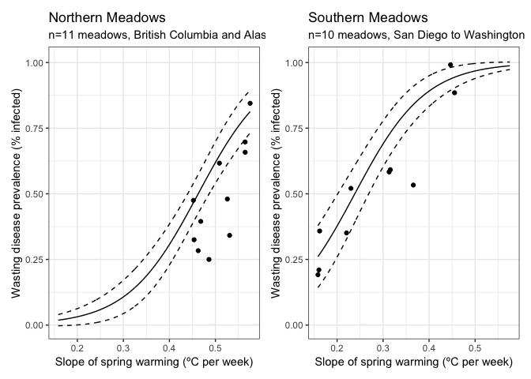

Disease Models II
================
LRA
4/17/2020

## Modeling seagrass wasting disease

Here, I modeled seagrass wasting disease at the meadow scale. Prevalence
and severity measurements on individual blades were averaged for each
meadow (3702 blades scanned across 32 meadows).

Explanatory variables were Blade Area, Shoot Density, Epiphyte Mass, and
Spring Warming.

Spring Warming was derived from MUR SST product - 1 km pixels. Because
many of our sites are in small estuaries, the coastal masking of land
excludes many sites (11 of 32 meadows). Without in situ HOBO data from
2019 for those sites, I plan to look for other sources of temp data
(e.g. NOAA, field station loggers)

Specfically for Spring Warming, I calculated the rate of warming in ºC
per week from April 1-June 30 2019.

I also included Region as a fixed effect.

Below is an abbreviated summary of the meadow level modeling with
temperature.

## Prevalence

I used beta regression to model Prevalence as the proportion of infected
blades in a meadow as a function of the parameters above.

During initial model selection, the best model had Blade Area, Spring
Warming, and Region as predictors. All were significant predictors.
Note, “sSlope” is the Spring Warming effect (scaled slope of temp
increase in Spring).

Post-hoc contrasts showed that the Regions grouped into “Super Regions”
- AK and BC were in one group (not significantly different form each
other) and WA, OR, SD were in another group (not significantly different
from each other and different from the AK/BC group). These Super Regions
followed geographic patterns, so I re-grouped the meadows as Northern
(AK and BC) and Southern (WA, OR, SD). Note, BB sites were excluded for
lack of temperature data.

    ##  Family: beta  ( logit )
    ## Formula:          PrevalenceMean ~ sBladeArea + sSlope + Region
    ## Data: sp
    ## 
    ##      AIC      BIC   logLik deviance df.resid 
    ##    -24.4    -16.0     20.2    -40.4       13 
    ## 
    ## 
    ## Overdispersion parameter for beta family (): 20.1 
    ## 
    ## Conditional model:
    ##             Estimate Std. Error z value Pr(>|z|)    
    ## (Intercept)  -2.0311     0.5359  -3.790 0.000150 ***
    ## sBladeArea   -0.4733     0.2684  -1.764 0.077801 .  
    ## sSlope        2.1615     0.5117   4.224 2.39e-05 ***
    ## RegionBC      0.2544     0.3906   0.651 0.514960    
    ## RegionOR      5.4936     1.4261   3.852 0.000117 ***
    ## RegionSD      3.9411     1.2319   3.199 0.001378 ** 
    ## RegionWA      3.8067     0.7290   5.221 1.77e-07 ***
    ## ---
    ## Signif. codes:  0 '***' 0.001 '**' 0.01 '*' 0.05 '.' 0.1 ' ' 1

    ## 
    ##   Simultaneous Tests for General Linear Hypotheses
    ## 
    ## Multiple Comparisons of Means: Tukey Contrasts
    ## 
    ## 
    ## Fit: glmmTMB(formula = PrevalenceMean ~ sBladeArea + sSlope + Region, 
    ##     data = sp, family = beta_family(link = "logit"), ziformula = ~0, 
    ##     dispformula = ~1)
    ## 
    ## Linear Hypotheses:
    ##              Estimate Std. Error z value Pr(>|z|)    
    ## BC - AK == 0   0.2544     0.3906   0.651  0.93676    
    ## OR - AK == 0   5.4936     1.4261   3.852  < 0.001 ***
    ## SD - AK == 0   3.9411     1.2319   3.199  0.00812 ** 
    ## WA - AK == 0   3.8067     0.7290   5.221  < 0.001 ***
    ## OR - BC == 0   5.2392     1.1843   4.424  < 0.001 ***
    ## SD - BC == 0   3.6867     0.9941   3.708  0.00156 ** 
    ## WA - BC == 0   3.5523     0.5199   6.832  < 0.001 ***
    ## SD - OR == 0  -1.5525     0.8597  -1.806  0.27312    
    ## WA - OR == 0  -1.6869     0.8056  -2.094  0.15660    
    ## WA - SD == 0  -0.1344     0.8002  -0.168  0.99961    
    ## ---
    ## Signif. codes:  0 '***' 0.001 '**' 0.01 '*' 0.05 '.' 0.1 ' ' 1
    ## (Adjusted p values reported -- single-step method)

With the new Super Region grouping, I re-ran the model with the same
other effects (Blade Area and Spring Warming)

    ##  Family: beta  ( logit )
    ## Formula:          PrevalenceMean ~ sBladeArea + sSlope + SuperRegion
    ## Data: sp
    ## 
    ##      AIC      BIC   logLik deviance df.resid 
    ##    -25.6    -20.4     17.8    -35.6       16 
    ## 
    ## 
    ## Overdispersion parameter for beta family (): 15.9 
    ## 
    ## Conditional model:
    ##                     Estimate Std. Error z value Pr(>|z|)    
    ## (Intercept)          -1.3110     0.2311  -5.672 1.41e-08 ***
    ## sBladeArea           -0.1683     0.1513  -1.112    0.266    
    ## sSlope                1.5734     0.2321   6.780 1.20e-11 ***
    ## SuperRegionSouthern   2.9209     0.4292   6.805 1.01e-11 ***
    ## ---
    ## Signif. codes:  0 '***' 0.001 '**' 0.01 '*' 0.05 '.' 0.1 ' ' 1

In the Super Region model, Spring Warming and Super Region were highly
significant. This suggests there is a temperature effect\!

The plots below show a model visualization - predicted values of wasting
disease prevalence at the meadow scale for each Super Region. The
relationships are quite distinct. Lines show the model predictions,
points show the empirical data.

<!-- -->

A few caveats. Clearly, the data set is limited - we only have 21
meadows. And, especially for the Northern meadows, they are bunched in
one part of the distribution. Adding the remaining 11 sites, if we can
get workable temperature data, might improve the model - or it might
totally wreck it, if BB sites do not follow this pattern\!

## Severity

Finally, for severity, I used the same approach (beta regression, same
predictors)

I am still working on model parameterization here - I’m not totally
happy with the model yet. But, the significant predictors and therefore
model inference have been pretty consistent as I’m tweaking the model:
Blade Area is a (weakly) significant predictor of severity at the meadow
level. Spring Warming is not.

There’s no pattern of Super Regions in the Region contrasts with
Severity.

    ##  Family: beta  ( logit )
    ## Formula:          SeverityMean ~ sBladeArea + sSlope + Region
    ## Data: sp
    ## 
    ##      AIC      BIC   logLik deviance df.resid 
    ##    -83.1    -74.7     49.5    -99.1       13 
    ## 
    ## 
    ## Overdispersion parameter for beta family (): 46.2 
    ## 
    ## Conditional model:
    ##             Estimate Std. Error z value Pr(>|z|)    
    ## (Intercept)  -3.9117     0.5400  -7.243 4.38e-13 ***
    ## sBladeArea   -1.0576     0.4185  -2.527  0.01149 *  
    ## sSlope        0.7123     0.5659   1.259  0.20813    
    ## RegionBC      0.2093     0.4575   0.457  0.64736    
    ## RegionOR      2.2178     1.4256   1.556  0.11979    
    ## RegionSD      0.7614     1.4679   0.519  0.60398    
    ## RegionWA      1.7769     0.5636   3.153  0.00162 ** 
    ## ---
    ## Signif. codes:  0 '***' 0.001 '**' 0.01 '*' 0.05 '.' 0.1 ' ' 1

    ## 
    ##   Simultaneous Tests for General Linear Hypotheses
    ## 
    ## Multiple Comparisons of Means: Tukey Contrasts
    ## 
    ## 
    ## Fit: glmmTMB(formula = SeverityMean ~ sBladeArea + sSlope + Region, 
    ##     data = sp, family = beta_family(link = "logit"), ziformula = ~0, 
    ##     dispformula = ~1)
    ## 
    ## Linear Hypotheses:
    ##              Estimate Std. Error z value Pr(>|z|)   
    ## BC - AK == 0   0.2093     0.4575   0.457  0.98497   
    ## OR - AK == 0   2.2178     1.4256   1.556  0.43990   
    ## SD - AK == 0   0.7614     1.4679   0.519  0.97620   
    ## WA - AK == 0   1.7769     0.5636   3.153  0.01024 * 
    ## OR - BC == 0   2.0085     1.2302   1.633  0.39277   
    ## SD - BC == 0   0.5521     1.1969   0.461  0.98449   
    ## WA - BC == 0   1.5676     0.4513   3.474  0.00342 **
    ## SD - OR == 0  -1.4564     1.1991  -1.215  0.66408   
    ## WA - OR == 0  -0.4409     1.0245  -0.430  0.98802   
    ## WA - SD == 0   1.0155     1.1806   0.860  0.86919   
    ## ---
    ## Signif. codes:  0 '***' 0.001 '**' 0.01 '*' 0.05 '.' 0.1 ' ' 1
    ## (Adjusted p values reported -- single-step method)

Overall, it looks like the rate of warming in spring may be an important
predictor for wasting disease prevalence, and that there is a strong
geographic effect. Geographic pattern could related to divergent
populations, phenotypic plasticity in response to different warming or
other environmental factors…
