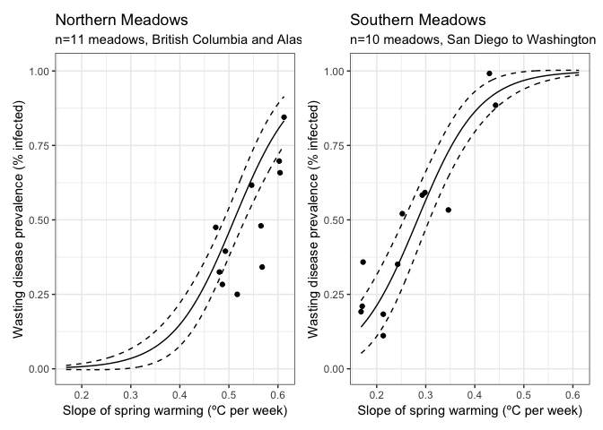

Disease Models III
================
LRA
4/21/2020

## Modeling seagrass wasting disease

This is an update to model results from Disease Models II doc, looking
at disease at the meadow scale with supplemental temperature data.
Prevalence and severity measurements on individual blades were averaged
for each meadow (3702 blades scanned across 32 meadows).

Explanatory variables were Blade Area, Shoot Density, Epiphyte Mass, and
Spring Warming.

Spring Warming was derived from MUR SST product - 1 km pixels. Because
many of our sites are in small estuaries, the coastal masking of land
excludes many sites (11 of 32 meadows). Here, I’ve added in 4 more
sites: OR-A and OR-B, in Coos Bay, where there is a NERR water quality
sampling station, and BB-F and BB-C, where I used in situ logger temps
from one of Jay’s students and temps predicted from a nearby buoy. The
NERR water temps fall between OR-A and OR-B for late summer and fall
(the period when we have HOBO loggers), so I’ve used the NERR data as
the temperature data for both OR-A and OR-B. This brings the total of
sites included in the model to 25.

The temperature variable I used was Spring Warming, I calculated the
rate of warming in ºC per week from April 1-June 30 2019.

I also included Region as a fixed effect.

Below is an abbreviated summary of the meadow level modeling with
temperature.

## Prevalence

I used beta regression to model Prevalence as the proportion of infected
blades in a meadow as a function of the parameters above.

During initial model selection, the best model had Blade Area, Spring
Warming, and Region as predictors. Spring Warming and Region were
significant predictors. Note, “sSlope” is the Spring Warming effect
(scaled slope of temp increase in Spring).

Post-hoc contrasts showed that the Regions grouped into “Super Regions”

AK and BC were in one group (not significantly different form each
other) and WA, OR, SD were in another group (not significantly different
from each other and different from the AK/BC group). These Super Regions
followed geographic patterns, so I re-grouped the meadows as Northern
(AK and BC) and Southern (WA, OR, SD). Note, BB sites were excluded for
lack of temperature data.

    ##  Family: beta  ( logit )
    ## Formula:          PrevalenceMean ~ sBladeArea + sSlope + Region
    ## Data: sp
    ## 
    ##      AIC      BIC   logLik deviance df.resid 
    ##    -21.6    -10.7     19.8    -39.6       16 
    ## 
    ## 
    ## Overdispersion parameter for beta family (): 13.3 
    ## 
    ## Conditional model:
    ##             Estimate Std. Error z value Pr(>|z|)    
    ## (Intercept)  -2.0241     0.7284  -2.779  0.00545 ** 
    ## sBladeArea   -0.2090     0.2995  -0.698  0.48531    
    ## sSlope        1.8554     0.5926   3.131  0.00174 ** 
    ## RegionBB      4.8095     1.2354   3.893 9.90e-05 ***
    ## RegionBC      0.1239     0.4690   0.264  0.79171    
    ## RegionOR      3.4319     1.4341   2.393  0.01671 *  
    ## RegionSD      3.2658     1.4122   2.313  0.02074 *  
    ## RegionWA      3.6185     0.8989   4.025 5.69e-05 ***
    ## ---
    ## Signif. codes:  0 '***' 0.001 '**' 0.01 '*' 0.05 '.' 0.1 ' ' 1

    ## 
    ##   Simultaneous Tests for General Linear Hypotheses
    ## 
    ## Multiple Comparisons of Means: Tukey Contrasts
    ## 
    ## 
    ## Fit: glmmTMB(formula = PrevalenceMean ~ sBladeArea + sSlope + Region, 
    ##     data = sp, family = beta_family(link = "logit"), ziformula = ~0, 
    ##     dispformula = ~1)
    ## 
    ## Linear Hypotheses:
    ##              Estimate Std. Error z value Pr(>|z|)    
    ## BB - AK == 0   4.8095     1.2354   3.893   <0.001 ***
    ## BC - AK == 0   0.1239     0.4690   0.264   0.9996    
    ## OR - AK == 0   3.4319     1.4341   2.393   0.1165    
    ## SD - AK == 0   3.2658     1.4122   2.313   0.1400    
    ## WA - AK == 0   3.6185     0.8989   4.025   <0.001 ***
    ## BC - BB == 0  -4.6857     0.9648  -4.856   <0.001 ***
    ## OR - BB == 0  -1.3776     0.7745  -1.779   0.3840    
    ## SD - BB == 0  -1.5437     0.6817  -2.264   0.1551    
    ## WA - BB == 0  -1.1910     0.6813  -1.748   0.4027    
    ## OR - BC == 0   3.3080     1.1342   2.917   0.0294 *  
    ## SD - BC == 0   3.1420     1.1324   2.775   0.0442 *  
    ## WA - BC == 0   3.4947     0.6264   5.579   <0.001 ***
    ## SD - OR == 0  -0.1660     0.8492  -0.196   0.9999    
    ## WA - OR == 0   0.1866     0.6866   0.272   0.9996    
    ## WA - SD == 0   0.3527     0.8369   0.421   0.9966    
    ## ---
    ## Signif. codes:  0 '***' 0.001 '**' 0.01 '*' 0.05 '.' 0.1 ' ' 1
    ## (Adjusted p values reported -- single-step method)

With the new Super Region grouping, I re-ran the model with the same
other effects (Blade Area and Spring Warming)

    ##  Family: beta  ( logit )
    ## Formula:          PrevalenceMean ~ sBladeArea + sSlope + SuperRegion
    ## Data: sp
    ## 
    ##      AIC      BIC   logLik deviance df.resid 
    ##    -26.9    -21.2     18.5    -36.9       18 
    ## 
    ## 
    ## Overdispersion parameter for beta family (): 14.1 
    ## 
    ## Conditional model:
    ##                     Estimate Std. Error z value Pr(>|z|)    
    ## (Intercept)          -2.0616     0.3169  -6.506 7.72e-11 ***
    ## sBladeArea           -0.1501     0.1595  -0.941    0.347    
    ## sSlope                1.9793     0.2863   6.914 4.73e-12 ***
    ## SuperRegionSouthern   3.5842     0.5261   6.812 9.60e-12 ***
    ## ---
    ## Signif. codes:  0 '***' 0.001 '**' 0.01 '*' 0.05 '.' 0.1 ' ' 1

In the Super Region model, Spring Warming and Super Region were highly
significant. This suggests there is a temperature effect\!

The plots below show a model visualization - predicted values of wasting
disease prevalence at the meadow scale for each Super Region. The
relationships are quite distinct. Lines show the model predictions,
points show the empirical data.

<!-- -->

A couple notes:

If I include BB\_E, which is a bit of an outlier, there’s no significant
effect of spring warming. Overall, I’m a bit hesitant with the BB sites,
as they currently rely on temperatures predicted by modeling site temps
off of nearby buoy temps.

Also might be important to consider that here I’m combining remote
sensing and in situ measurements, which have different biases. Not
really any way around that if we want to include the 11 sites that we
can’t get remote SST.

I’m not sure what to make of the geographic split - it’s certainly
interesting but might be an artifact more than anything else.

## Severity

Finally, for severity, I used the same approach (beta regression, same
predictors)

I am still working on model parameterization here - I’m not totally
happy with the model yet. But, the significant predictors and therefore
model inference have been pretty consistent as I’m tweaking the model:
Blade Area is a significant predictor of severity at the meadow level.
Spring Warming is not.

There’s no pattern of Super Regions in the Region contrasts with
Severity. But, WA has greater severity than other sites. Perhaps because
wasting disease is so well established in WA?

    ##  Family: beta  ( logit )
    ## Formula:          SeverityMean ~ sBladeArea + sSlope + Region
    ## Data: sp
    ## 
    ##      AIC      BIC   logLik deviance df.resid 
    ##    -80.9    -70.0     49.5    -98.9       16 
    ## 
    ## 
    ## Overdispersion parameter for beta family (): 48.5 
    ## 
    ## Conditional model:
    ##             Estimate Std. Error z value Pr(>|z|)    
    ## (Intercept)  -3.2724     0.5712  -5.729 1.01e-08 ***
    ## sBladeArea   -0.9973     0.3190  -3.126  0.00177 ** 
    ## sSlope        0.4160     0.4913   0.847  0.39717    
    ## RegionBB      0.1416     1.0224   0.138  0.88986    
    ## RegionBC      0.6217     0.3848   1.616  0.10618    
    ## RegionOR      1.7745     1.1641   1.524  0.12743    
    ## RegionSD      0.3925     1.2107   0.324  0.74577    
    ## RegionWA      1.3146     0.6154   2.136  0.03266 *  
    ## ---
    ## Signif. codes:  0 '***' 0.001 '**' 0.01 '*' 0.05 '.' 0.1 ' ' 1

    ## 
    ##   Simultaneous Tests for General Linear Hypotheses
    ## 
    ## Multiple Comparisons of Means: Tukey Contrasts
    ## 
    ## 
    ## Fit: glmmTMB(formula = SeverityMean ~ sBladeArea + sSlope + Region, 
    ##     data = sp, family = beta_family(link = "logit"), ziformula = ~0, 
    ##     dispformula = ~1)
    ## 
    ## Linear Hypotheses:
    ##              Estimate Std. Error z value Pr(>|z|)
    ## BB - AK == 0   0.1416     1.0224   0.138    1.000
    ## BC - AK == 0   0.6217     0.3848   1.616    0.483
    ## OR - AK == 0   1.7745     1.1641   1.524    0.544
    ## SD - AK == 0   0.3925     1.2107   0.324    0.999
    ## WA - AK == 0   1.3146     0.6154   2.136    0.200
    ## BC - BB == 0   0.4801     0.7767   0.618    0.980
    ## OR - BB == 0   1.6329     0.7500   2.177    0.184
    ## SD - BB == 0   0.2510     0.5893   0.426    0.996
    ## WA - BB == 0   1.1730     0.6470   1.813    0.360
    ## OR - BC == 0   1.1528     0.9418   1.224    0.743
    ## SD - BC == 0  -0.2291     0.9449  -0.242    1.000
    ## WA - BC == 0   0.6930     0.4122   1.681    0.440
    ## SD - OR == 0  -1.3819     0.8501  -1.626    0.477
    ## WA - OR == 0  -0.4599     0.6816  -0.675    0.971
    ## WA - SD == 0   0.9221     0.8195   1.125    0.801
    ## (Adjusted p values reported -- single-step method)
